# Referencial Teórico
## A Questão da Conversão Religiosa na Sociologia

```{r, include = FALSE}
uma <- c("#474344")
duas <- c("#474344", "#943D2C")
tres <- c("#943D2C", "#E5BD77" ,"#474344")
quatro <- c("#943D2C", "#474344" ,"#DFD0BB", "#E5BD77")
cinco <- c("#E5BD77", "#CC7952", "#DFD0BB", "#943D2C", "#474344")
likert <- c("#474344", "#943D2C", "#CC7952", "#DFD0BB", "#E5BD77")
```


  Seja por não haver uma definição única, seja pela falta de consenso na área sobre o tema, a Conversão Religiosa se tornou com o passar dos anos uma das temáticas mais controversas que a Sociologia da Religião se debruça e tenta rastrear. Foi durante a década de 60 que ela se tornou um objeto de estudo propriamente sociológico, graças a alta demanda de pesquisas sobre o crescimento quase exponencial de novos movimentos religiosos na América do Norte [@snow_sociology_1984, 167]. As primeiras discussões no campo sociológico, assim como uma primeira tentativa de criar um modelo explicativo para a conversão, remetem aos estudos feitos em 1965 por Lofland e Stark [@stark_acts_2000-1]. Seus resultados se encontram no artigo _“Becoming a world-saver: a theory of conversion to a deviant perspective”_.

  Desse período em diante vários estudos foram conduzidos, seja para confirmar os achados de Lofland e Stark, seja para apontar erros ou sugerir novas rotas de análise. A partir da observação do conjunto de trabalhos e proposições produzidas, alguns autores defendem a existência de dois grandes paradigmas que conduziam as pesquisas até então feitas: um que focava em _elementos estruturais e exteriores_ ao indivíduo e um segundo que abordava a conversão a partir do _próprio sujeito e sua trajetória_. Em outras palavras, o nível de agência é o que caracterizaria e daria o tom a cada uma das formas pelas quais a Conversão Religiosa foi estudada dentro da Sociologia até o presente momento. Apesar desta discussão extensa sobre as formas pelas quais um sujeito chega a se converter ser extremamente importante uma outra pergunta deve ainda ser feita para que um total entendimento sobre a discussão seja, de fato, atingido: _O que é uma conversão?_

  Apesar de simples esta segunda pergunta gera muitos conflitos na área e até o presente momento não possui uma resposta definitiva: Mudança radical, Trajetória, Transformação do Discurso ou simplesmente Mudança de Religião são algumas das várias opções possíveis oferecidas pela literatura para definir este fenômeno. Isso acontece pois são diversas as variáveis e as searas que se entrecruzam no processo de explicar a conversão. Cada um dos paradigmas anteriormente citados definia este fenômeno à sua maneira, cabendo ao pesquisador optar pela definição que melhor se encaixasse em seu _framework_.

  Nos próximos capítulos cada uma das problemáticas acima citadas serão adereçadas. Primeiramente serão apresentadas cada uma das abordagens explicativas da Conversão Religiosa, suas principais características, suas críticas e como a temática vem sendo trabalhada no Brasil. Logo em seguida se discutirá sobre o que, de fato, esse fenômeno é. Acredito que possa parecer estranho ao leitor inverter a ordem da discussão, mas pode ser mais fácil enxergar o que um elemento é a partir de seus modos de ser. Ao final será feita uma discussão sobre estratégias de mensuração deste conceito, avaliando as possibilidades e limitações. 


### O Paradigma Tradicional

  Como colocado anteriormente podem-se distinguir dois grandes paradigmas para explicar Conversões Religiosas. O primeiro a ser criado é o chamado tradicional. Ele é focado principalmente em elementos exteriores ao indivíduo e na sua falta de agência sobre o processo e é melhor representado na Conversão do apóstolo Paulo narrada no livro bíblico de Atos dos Apóstolos^[Cf. At 9:01-22.]. Nele as Conversões se configuravam como momentos de extrema comoção e epifania catalisadas pela suposta sensação do agir de um poder ou divindade maior e alheio ao indivíduo. Esse fenômeno também possui a capacidade de transformar radicalmente a vida do sujeito, de forma a determinar divisores de água em sua biografia [@richardson_active_1985, 165]. Esse tipo de Conversão é a que mais se aproxima da noção do senso comum sobre o assunto, dado que promove o renascimento pessoal e a “morte” de um suposto “antigo eu” [@kilbourne_paradigm_1989,1]. 

  Ao ser tratado pela Sociologia, no entanto, esse modelo passa a ganhar novos contornos e significações. Inicialmente ocorre um distanciamento do caráter místico/teológico do fenômeno e são adicionados dois elementos que tinham um enorme papel no entendimento da Conversão Religiosa enquanto um fenômeno social: A _Socialização_ e a _Coerção_.

  Autores como Toch [-@toch_social_2013] que tentam explicar o processo de Conversão através da Socialização tendem a assumir que é ela quem delimita o quão predisposto um indivíduo está ou não a se converter a um determinado credo. Suas experiências prévias, especialmente as vivenciadas na infância, são o que conduzem todo o processo e o guiam a religiões e cultos com características similares as da primeira socialização [@kilbourne_paradigm_1989,08]. A Coerção, por outro lado, se baseia no uso de técnicas de restrição e isolamento do sujeito em ordem de torná-lo um convertido, esse tipo costuma ser mais comum entre seitas. A soma de elementos psicológicos como a atração de indivíduos com maior grau de vulnerabilidade emocional e da indução de _breakdowns_ sociais e emocionais, combinada muitas vezes com o afastamento do indivíduo de suas redes sociais, lentamente o induzem ao total estado de submissão e controle do culto, não é à toa que esse modelo também é chamado de _Lavagem Cerebral_ (brainwashing). É exatamente esta operação que a Sociologia Norte Americana acreditava que acontecia em cultos como o Hare Khrishna, Synanon ^[Synanon, que será tratada no segundo capítulo, é considerada a precursora do modelo de Comunidades Terapêuticas que será aqui pesquisado.] e algumas Igrejas Pentecostais, que na época eram consideradas seitas [@robbins_deprogramming_1982,283]. 

  Esse modelo, apesar de ter sido uma das primeiras tentativas de se entender a Conversão Religiosa, é bastante criticado e pouco usado [@gooren_reassessing_2007-1, 346]. Uma das primeiras críticas feitas é a exclusão total do indivíduo no processo de Conversão, cabendo a ele apenas repetir padrões ensinados na infância ou ser manipulado. Não levar em consideração no modelo o próprio sujeito e a sua vontade, que ganha cada vez mais força para fazer suas opções e traçar suas rotas a partir do advento da modernidade, é não estar em consonância com a realidade, sem falar que não há provas empíricas de que esses mecanismos realmente ocorram nos processos de Conversão [@gooren_reassessing_2007-1, 346].

### O Novo Paradigma: Modelos de Conversão Ativa

 Apesar do paradigma tradicional ter sido um dos primeiros a ser pensado a sua repercussão foi baixa. Um segundo, pensado a partir das limitações deste, foi quem conseguiu mais espaço. Intitulado por alguns autores como “Novo Paradigma”, ele tinha como principal característica o foco na agência do indivíduo no processo de Conversão. As escolhas e preferências pessoais, significados, sentidos e negociações são temas chaves [@kilbourne_paradigm_1989,02]. Um outro diferencial desse modelo é seu distanciamento total de elementos teológicos, o que facilitou sua acolhida dentro da Sociologia. Podem-se destacar nessa classe os modelos _intelectual_, de _deriva social_ e _experimental_.

 No modelo intelectual, como o próprio nome sugere, a conversão se dá através do contato do próprio indivíduo com conteúdo religioso/espiritual, sem a necessidade da comunidade, interação social ou de qualquer outro _input_ [@lofland_conversion_1981,376]. Livros, vídeos, televisão etc. oferecem subsídios para que, sozinho, o indivíduo possa moldar suas próprias experiências [@lofland_conversion_1981,377]. Apesar desse modelo ser bastante incomum na época em que foi criado é possível pensar o quanto ele se faz presente na atualidade com os avanços e facilidades que a era digital trouxe. Não é à toa que alguns pesquisadores chamam a internet de _“dataline do paraíso”_ [@george_religion_2006,86]. Por meio dela é possível ter acesso a cultos, celebrações, eventos e doutrinas para que, por conta própria, o indivíduo possa, no seu ritmo, digerir a doutrina e a ela se ajustar.

  O modelo experimental^[Do original, _seeker_] é o mais popular dentre os modelos ativos. Nele o sujeito está aberto a experimentação e faz seu próprio caminho rumo a Conversão. Diferente do modelo passivo aonde o contato com o divino era crucial, definitivo e transformador aqui ele é apenas o ponto de partida. As mudanças, quando ocorrem, são graduais e no ritmo do indivíduo, que é livre para dosar o quanto aceita de forma plena e o quanto adapta a sua própria realidade [@kilbourne_paradigm_1989,06 ; @gooren_reassessing_2007-1,346]. Admite-se também neste modelo a existências de múltiplas conversões, dada a variedade de experiências que se permite viver e da construção de Carreiras de Conversões [@richardson_active_1985,172].

  Fora da Sociologia Norte Americana também é possível encontrar modelos bastante similares. Um dos exemplos, mesmo que não seja relacionado diretamente a uma categoria de Conversão, é a do Peregrino de Hervieu-Leger [-@hervieu-leger_peregrino_2015]. Para ela a modernidade atuaria sobre a religião de duas formas. A primeira seria na dissolução da chamada “civilização paroquial” e a segunda na flexibilização do ser religioso, instaurando assim uma condição de _“peregrino”_. 

  Herdeira direta do catolicismo, tal civilização paroquial se manifesta na figura do praticante ou convertido, que é entendido enquanto indivíduo que atende fielmente as obrigações impostas pela igreja e articula sua vida em torno da comunidade e das expressões diárias de fé [@hervieu-leger_peregrino_2015,84]. A diminuição da influência da igreja sobre a sociedade e o advento da modernidade, no entanto, fazem com que essa civilização perca força e uma nova figura se estabeleça: o _peregrino_. Diferente do praticante que se define pela sua vivência religiosa estática, o peregrino age a partir da bricolagem, ou ajustes, entre crença e experiência, cabendo a ele interpretar suas experiências de forma a moldar uma trajetória [@hervieu-leger_peregrino_2015,89]. Outro diferencial do peregrino é sua relação com a comunidade, que atua como uma espécie de “apoio” ao invés de determinador das suas ações [@hervieu-leger_peregrino_2015,86].

 Por fim, o modelo de Deriva Social^[Do original, _social drift_.], também conhecido como modelo de Long e Hadden [-@long_religious_1983], é bastante similar ao modelo experimental, a principal diferença entre eles é a inserção de uma nova variável no processo de construção identitária: os _fatores situacionais_. Stress, situações inesperadas tendem a colocar o indivíduo em estado de tristeza/dor e outros fatores se tornam gatilhos para que se busque ajuda na religião e a partir desse processo novas identidades e visões de mundo são construídas, guiando assim o processo de Conversão [@kilbourne_paradigm_1989,07].

  Apesar de ser um modelo que inclui o indivíduo ele falha ao desconsiderar a estrutura ou os chamados “elementos passivos” que coexistem com os ativos no processo de conversão. Não integrar agência individual e estrutura/fatores institucionais torna grande parte das premissas elaboradas incompletas. A linha que divide a Conversão enquanto “processo” ou “evento” não é rígida, e uma abordagem que leve ambos os paradigmas em consideração é a melhor para lidar com este fenômeno (@flinn_conversion_1999,55). Em outras palavras, a aceitação de uma individualização na vivência da Conversão não deve excluir completamente processos nos quais o indivíduo se transforma radicalmente e se entrega de forma total a instituição e seus ideais, mesmo se isso não ocorrer aos moldes dos antigos modelos de adesão [@rosas_conversao_2015,05].

### Modelos Mistos: Integrando Estrutura e Agência

  Feitas as devidas explanações e críticas aos modelos exclusivistas (tradicional e ativo) resta abordar modelos que levem em consideração elementos de ambos os paradigmas e tentam superar tanto o determinismo quanto o voluntarismo presente nas versões anteriores. Um dos primeiros a ser destacado é o da Escolha Racional, no qual a escolha por se converter/filiar ou não a alguma religião/culto seria guiada pela racionalidade e teria como principal fator a preservação de um capital religioso acumulado com o passar dos anos [@stark_acts_2000-1,119]. Partindo desta noção, Stark e Finke criam um modelo para a Conversão baseado no nível de preservação do Capital Religioso e Cultural de um indivíduo. 

  Processos de Conversão seriam caracterizados por um trânsito **entre** tradições religiosas, ou seja, não existiria preservação de capital dado que ele seria totalmente remodelado seguindo os moldes da nova tradição ao qual o sujeito se converteu [@stark_acts_2000-1,114]. Um segundo processo, no entanto, também é perceptível e até mais comum do que este primeiro: o de _Refiliação_. Tal processo se configura como trânsito **dentro de** uma mesma tradição religiosa [@stark_acts_2000-1,114]. Ou seja, existiria alguma preservação de capital dado que não se opera uma mudança cultural brusca. Nesses casos ocorre apenas a mudança de denominação dentro do escopo de uma mesma tradição. Processos de refiliação acabam por ser os mais frequentes e, ao executar estes processos, os indivíduos tendem a procurar opções que melhor se encaixem em seu atual arcabouço religioso, em ordem de otimizar sua manutenção [@stark_acts_2000-1,123]. 

  Ao avaliar ambas as noções apresentadas por este modelo, se torna perceptível sua ligação com modelos de socialização, mas diferente deste existe a possibilidade de romper com o que já se tem construído a partir de um processo (literal) de Conversão. O grande diferencial, no entanto, está no conceito de _Capital Religioso_. Criado com base na noção de "Capital Social" de Bourdieu, ele é definido enquanto “grau de domínio e apego a uma cultura religiosa particular” [@stark_acts_2000-1,120]. Em outras palavras, é o nível de investimento emocional e cultural que o molda. Os indivíduos, em condições normais, tendem a preservá-lo ao optar por não fazer nenhuma das duas transições possíveis [@stark_acts_2000-1,121]. É importante destacar a ênfase na expressão “condições normais” pois, como debatido por outros modelos, situações extraordinárias como morte, separação, migração, casamentos, angústias e tristezas podem conduzir o indivíduo ao questionamento deste arcabouço que já possui e tentar encontrar um novo através do processo de busca e experimentação. 

  É possível, ainda, estabelecer algumas conexões entre as noções de peregrino e processos de refiliação. Todos compartilham de um certo grau de autonomia do indivíduo em ser o próprio ator de sua trajetória religiosa e por optar como pretende viver sua fé. Cada vez menos se dá foco em identidades mais institucionalizadas e começa a se admitir, por exemplo, a existência de “crentes sem igreja”, pessoas que vivem a fé do seu jeito e até mesmo um crer sem pertencer [@davie_believing_1990; @willaime_sociologia_2012-1,135].

  Um segundo modelo é o criado por Lofland e Stark, citado no começo deste capítulo. Ao estudar as motivações para conversão dentro de um culto chamado _“Lord of the Second Advent”_ os autores chegam ao que seriam 7 passos necessários para uma pessoa se tornar convertida, a se saber:

> 1.	Experience enduring, acutely felt tensions
2.	Within a religious problem-solving perspective,
3.	Which leads him to define himself as a religious seeker;
4.	Encountering the Divine Precepts^[Chamado ao longo do texto de D.P, é o conjunto de preceitos do culto estudado pelos autores [@lofland_becoming_1965-1,863].]at a turning point in his life,
5.	Wherein an affective bond is formed (or pre-exists) with one or more converts;
6.	Where extra-cult attachments are absent or neutralized
7.	And, where, if he is to become a deployable agent, he is exposed to intensive interaction. 
[@lofland_becoming_1965-1,874]

  Percebe-se neste modelo a presença de elementos “ativos” nos primeiros pontos, especialmente no ponto 3. Do 4 ao 6 temos condições situacionais e estruturais, elementos passivos. A ênfase em unidades estruturais e na recriação dos laços afetivos com outros membros do culto é combinada com a vontade pessoal do convertido, gerando assim uma espécie de sinergia entre os componentes. No entanto, como este foi um dos primeiros modelos criados e ainda foi elaborado com base em um culto não convencional ele apresentava erros e foi bastante criticado, em especial pela falta de fundamentação empírica e especificidade do caso estudado, o que limitava generalizações e replicações [@gooren_reassessing_2007-1,338].

  Um último modelo misto a ser destacado é o de Carreira de Conversão elaborado por Richardson[-@richardson_conversion_1977] em seu livro _Conversion careers: In and out of the new religions_ e refinado por Gooren em seus trabalhos posteriores [-@gooren_reassessing_2007-1; -@gooren_religious_2010-1]. Pensar este fenômeno enquanto carreira permite analisá-lo por várias frente e ainda captura com clareza as várias experimentações realizadas ao longo da vida religiosa de um sujeito. Para além disso ele é sensível a idade, elemento que não era levado em consideração até então [@richardson_active_1985,49]. Gooren, no entanto, incrementa esse conceito ao redefini-lo enquanto “passagem do membro, dentro de seu contexto social e cultural, por níveis, tipos e fases de participação na igreja” [@gooren_reassessing_2007-1,349]. O foco deixa de ser apenas a carreira num sentido macro, interinstitucional, mas também micro, dado que avalia os níveis de participação [@girardo_rodriguez_religious_2021]. O modelo, enfim, se enriquece ao incluir tanto os pré estágios da conversão quanto os finais que configuram no afastamento da instituição, chamada de desfiliação. A imagem abaixo representa o que viria a ser o ciclo de vida do indivíduo numa instituição religiosa e os níveis de cometimento:


```{r imagem, fig.cap = "Fases da Conversão Religiosa.", fig.pos = "H", fig.align='center', echo=FALSE, out.width="80%"}
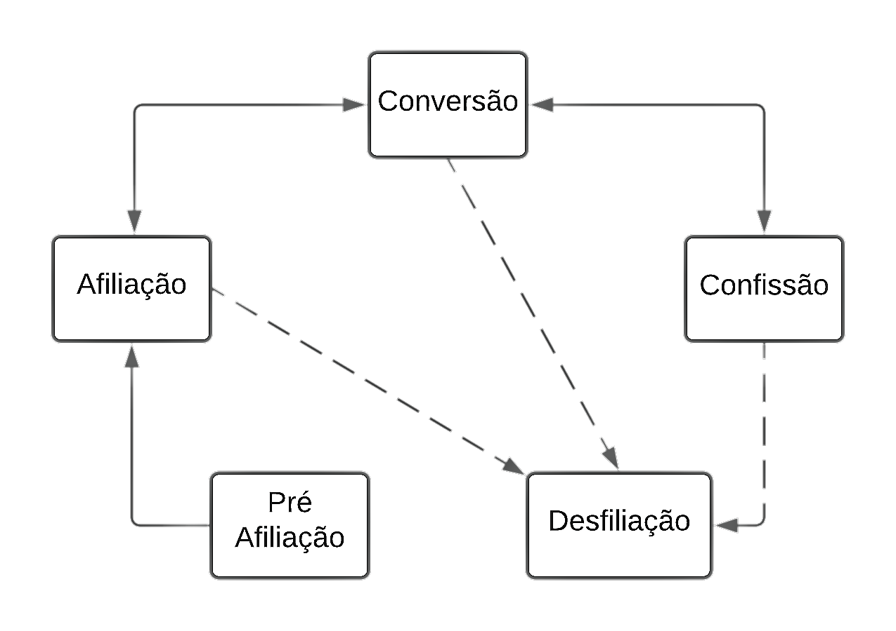
```
\bcenter
Fonte: Gooren[-@gooren_reassessing_2007-1]
\ecenter

  A pré afiliação consiste nas visitas esporádicas ou de reconhecimento feitas a uma dada religião/culto, elas configuram uma aproximação sem compromisso. A filiação, por sua vez, representa um aumento no grau de cometimento com a instituição, as visitas ocorrem com mais frequência e o indivíduo se torna um membro formal. A conversão representa a alteração da identidade e das visões de mundo, percebida pelo próprio sujeitos e confirmada pelos que estão ao redor. A confissão representa o grau de cometimento completo com a visão da organização e o desenvolvimento de um “espírito missionário” em relação aos não membros. A desfiliação, por fim, representa o afastamento total [@gooren_reassessing_2007-1,350].

  Dois elementos deste modelo podem ser destacados. O primeiro é a relação entre agência e estrutura representada pelas setas, percebe-se que a qualquer momento é permitido ao sujeito a possibilidade de “pular” ou “regredir” estágios. É totalmente possível, por exemplo, sair da Conversão para a Desfiliação. A vontade pessoal do indivíduo e seu poder de controle do processo são levados em conta ao mesmo tempo que não se omite o peso que a estrutura tem ao lhe oferecer uma “rota institucional”. O segundo ponto a ser destacado é que também são levados em consideração nesse modelo fatores etários, sociais, culturais, contingenciais, institucionais e de personalidade. De modo a criar um panorama completo da trajetória pessoal [@gooren_reassessing_2007-1,351]. 

### O que Muda e o que Resiste: O Estado da Conversão nos estudos acadêmicos nacionais

  Até agora foram debatidos alguns dos modelos de Conversão mais utilizados pela Sociologia Norte Americana. Estes modelos, no entanto, são pensados segundo a realidade de onde foram criados e não costumam se encaixar perfeitamente nas vivências de outras localidades, especialmente em países como o Brasil aonde a cultura e as vivências religiosas possuem padrões bastante específicos. Nos parágrafos abaixo irei discutir rapidamente sobre as especificidades do caso brasileiro, em especial sobre como este fenômeno vem sendo adereçado, tipologias empregadas e discussões atuais.

#### O Caso Brasileiro

  De modo geral o panorama brasileiro se caracteriza pela maioria da população sendo criada dentro do Catolicismo, religião majoritária no país. É nesse meio aonde a vida religiosa de muitos é iniciada e de onde advêm boa parte dos elementos presentes no dia a dia como, por exemplo, nomes de ruas e estados (São Paulo, Santa Catarina, Espírito Santo etc.) [@prandi_converting_2008]. Por consequência prática não seriam identificados muitos casos de Conversão caso a análise fizesse uso, por exemplo, das ferramentas da Escolha Racional. As mudanças para o Protestantismo seriam interpretadas como simples refiliação dado que ambas as religiões compartilham do mesmo arcabouço cristão. 
  
  Para além disso outras especificidades tendem a ir contra uma parte dos modelos existentes. A IURD^[Igreja Universal do Reino de Deus], por exemplo, que se encaixa no rol das chamadas _Religiões de Salvação_, ou seja, possuem foco em Conversão e dão a garantia da Salvação Eterna [@pierucci_religiao_2006,121], não tem forte apelo a ruptura e nem exige, necessariamente, mudanças bruscas nos padrões de comportamento. Todas essas particularidades aqui citadas vão totalmente contra o que os modelos Norte Americanos de Conversão pressupunham [@mafra_na_2018].

  Foi com essas questões em mente que Sociólogos e Antropólogos, mais os segundos do que os primeiros, se debruçaram sobre a temática e geraram modelos e discussões, ora profícuas, ora problemáticas, que pudessem fornecer pistas para entender esse fenômeno e suas especificidades no caso brasileiro. Os estudo sobre Conversão começam no país na década de 80 e tendem a ser relacionados, no início, ao Pentecostalismo que começava a ganhar força no país [@prandi_converting_2008,156; @lamb_religious_1999,10] e aos encontros e desencontros da Umbanda com o Catolicismo [@birman_cultos_1996] e depois com o Protestantismo [@mafra_o_2002]. Outras pesquisas também se debruçavam sobre a relação entre os processos de Conversão outros elementos da vida social como Gênero [@machado_conversao_1998], Pobreza [@mariz_religiao_1991], Crime [@cunha_traficantes_2008] e até mesmo Comunidades Terapêuticas [@targino_experiencias_2020].
  
  
  Dentro do escopo destas pesquisas as definições de Conversão tendem a levar em consideração três elementos: _Ruptura_, _Negociação_ e _Gramática_ [@teixeira_processos_2021]. Esses conceitos costumam vir interligados nas definições de tal forma que falar deste tema no contexto nacional é falar diretamente sobre eles. A ruptura diz respeito ao processo de geração de novos sujeitos a partir de rompimentos com versões de si, tratando então o fenômeno enquanto processo de _descontinuidade existencial_. Apesar de se aceitar essa descontinuidade também se aceita que ela não é necessariamente total ou radical. Seja por motivos culturais ou por consequências da modernidade, é possível constatar a existência de áreas cinzas dentro do cometimento que permitem que a mudança seja mediada, ou negociada, pelo próprio sujeito como foi destacado, por exemplo, no caso da IURD. A esse processo dá-se o nome de Negociação. A gramática, por fim, diz respeito ao conjunto de ferramentas oferecidas pela doutrina que são assimiladas pelo indivíduo e que auxiliam na tradução do mundo ao redor. É também através da obtenção e uso dela que as mudanças de _self_ advindas dos processos de ruptura costumam se manifestar no mundo exterior. 

#### Minimalismo e Maximalismo  

  Um dos modelos desenvolvidos com base nas noções discutidas no parágrafo anterior, e que se destaca enquanto exemplo de como esses conceitos são trabalhados, é o de Clara Mafra. Em seu livro _Na posse da palavra: Religião, Conversão e Liberdade Pessoal_, a autora constata, a partir de trabalho de campo, a existência de dois tipos de conversão: A _Maximalista_ e a _Minimalista_. No modelo maximalista ela acontece a partir da coesão e do controle do grupo, que o encaminha para um “novo mundo de crenças e disposições” [@mafra_na_2018], ou seja, aqui tem-se o modelo tradicional, aonde a estrutura se sobrepõe à vontade individual. 

  O grande diferencial desse modelo se encontra no que ela chama de _Conversão Minimalista_. Nesse tipo ocorre uma maior plasticidade entre a interação agência/estrutura, de forma que não se torna necessário uma mudança abrupta de vida ou uma transformação radical de hábitos para que o fenômeno aconteça. O que conta é articulação feita pelo próprio sujeito do capital adquirido via Conversão [@mafra_na_2018]. Nos casos por ela analisados os sujeitos pesquisados sempre moldavam de forma _sui generes_ como este evento atingia suas vidas. Não havia mudanças de sociabilidade, nem necessidade de ressignificação total do passado, tal qual preconizava os modelos antigos.

  Apesar dessa autonomia não se deve confundir esse processo com o da individualização advinda da modernidade que aparece nas discussões dos modelos ativos de Conversão. No modelo minimalista os processos são orgânicos e não existe uma individualização _ipsi literi_, mas sim a construção de um _“projeto de identidade”_ que funciona “no tempo de Deus”, ou seja, é aberto a intempéries e obras do acaso. Essa forma de vivenciar a Conversão é bastante próxima dos processos de bricolagem citados por Hervieu-Leger e dos modelos de trajetória vistos no capítulo anterior. 
  
  Da mesma forma que outros modelos aqui citados destaca-se como ponto a ser criticado a desatenção a elementos estruturais que também possuem impacto sobre como o indivíduo dispõe e manuseia do que lhe é oferecido. Apesar disso, admite-se que essa omissão é, em parte, compensada pela atenção aos contextos no qual as Conversões ocorrem.


#### Panorama Atual
  
  A crítica a falta de atenção a estrutura, apesar de compensada em alguns casos, é apenas um dos problemas no que diz respeito a como a Conversão vem sendo tratada a algum tempo na literatura nacional. Entende-se a vivência da religiosidade nas pesquisas mais atuais enquanto um processo extremamente fluido, no qual se imperam _Continuidades_ [@almeida_transito_2001]. Assume-se, na maioria das vezes, que os processos são negociáveis e que em alguns casos são até inexistentes. A consequência prática disso é um certo "sumiço" do conceito de filiação. A vivência da religiosidade, mais do que nunca, acontece dentro dos limites impostos pelo próprio sujeito o que cria híbridos e formas únicas de se viver, ou não viver, a fé. Não é baixo o número de produções, principalmente na Antropologia, que são criadas nesses moldes e dão força a essa concepção [@oro_o_2006; @reinhardt_espelho_2006; @aureliano_eu_2021]. 
  
  Tal perspectiva advém, em parte, do peso excessivo que se dá as noções de negociação e de sincretismo nas análises. É comum no ambiente acadêmico pensar o brasileiro enquanto sujeito de pouco cometimento e propenso ao sincretismo [@frigerio_identidades_2005,232], essa forma de enxergar, ou _estrabismo_ como pontuam Campos e Reesink [-@reesink_conversao_2014,55], penetra as pesquisas sobre religião na forma de elevada atenção a aspectos que favorecem essa porosidade, como multifiliação e fluidez das trajetórias religiosas ou até mesmo no hábito de produzir pesquisas que favoreçam visões desse tipo como as citadas a pouco. Ser brasileiro é ser sincrético e visões contrárias a essa lógica vem sendo pouco debatidas pela produção nacional [@reesink_conversao_2014].
  
  Isso, no entanto, tem como principal consequência a "morte" do conceito de Conversão no panorama intelectual nacional [@reesink_conversao_2014] dado que esse fenômeno repousa, como visto anteriormente, nas noções de rompimento e transformação. Se tais elementos são suprimidos da equação e se admite, por outro lado, o oposto disso, a ideia perde o sentido e sua aplicação em produções científicas se torna menor. Em outras palavras, para a Academia, brasileiros não parecem mais se converter à moda antiga.
  
  Apesar de ser importante reconhecer o que muda nesses processos e quais novidades surgem é tão importante quanto entender o que permanece. Aceitar que existem continuidades e negociações não deve ser feito a base de suprimir o oposto. A flexibilização e a filiação total coexistem na realidade e devem ser considerados nas produções, em ordem de possibilitar um entendimento honesto da vivência religiosa. É no _processo_, no fim das contas, e não nos elementos específicos que dele despontam que se deve focar. Não considerar este fenômeno enquanto processual apenas aumenta as chances de produzir visões distorcidas e enviesadas do campo religioso e de suas vivências [@engelke_discontinuity_2004; @teixeira_processos_2021; @reesink_conversao_2014].  
  
### Definindo Conversão

  Toda esta discussão sobre como a Conversão acontece oferece, no fim das contas, várias pistas de como defini-la. Uma das primeiras é que uma variedade de abordagens gera uma variedade de definições, logo não existe uma resposta concreta sobre “o que é Conversão Religiosa”. Tudo depende, no fundo, do ponto de vista que se opta por assumir. A primeira definição, e também a que impera no senso comum, é a de que Conversão é a simples mudança de igrejas/culto. Isso, no entanto, é oriundo do senso comum e pouco agrega a uma visão científica deste fenômeno. 

  Em ordem de superar esta limitação foram criadas algumas definições das quais três se destacam pelo uso na construção de vários modelos sociológicos. A primeira é a da Conversão enquanto _“mudança pessoal radical”_. Muito comum nos modelos passivos, em especial no Paulino, um sujeito só pode se considerar um convertido quando acontecer uma ruptura total em sua personalidade e formas de ser/estar no mundo [@snow_sociology_1984,169 ; @snook_issues_2019,224]. Essa definição, no entanto, recaí sobre a visão teológica e não há especificações sobre como e em qual grau essa mudança deve ocorrer para que seja considerada uma Conversão [@snow_sociology_1984,169], o que colabora com a diminuição do uso dessa definição específica nas pesquisas hodiernas sobre o assunto.
  
  Uma segunda definição é a fornecida por Stark e Finke [-@stark_acts_2000-1] ao proporem o modelo da Escolha Racional. Para os autores ela é caracterizada única e exclusivamente pela “mudança de tradição religiosa” [@stark_acts_2000-1,114]. A transição entre religiões dentro de um mesmo espectro, como por exemplo, Catolicismo e Protestantismo, não seria categorizada como Conversão, e sim Refiliação. Casos de Conversão não são comuns dado que geram altos gastos de energia e Capital Religioso [@stark_acts_2000-1,119]. Apesar de ser um modelo bastante pragmático se torna difícil a aplicação em locais com hegemonia religiosa e poucas opções de mercado.
  
  Uma última definição, essa mais utilizada nas pesquisas contemporâneas e que será aqui adotada, é a da Conversão enquanto _“Mudança no universo de discurso”_. Para além de produzir mudanças na identidade, valores e crenças do indivíduo, ela opera uma mudança no seu universo discursivo, na realidade central e é essa mudança específica que caracterizaria a Conversão Religiosa [@snow_sociology_1984,170]. Quando se opera uma mudança no universo discursivo se altera as formas até então utilizadas para entender e traduzir o mundo ao redor, se um elemento _X_ era traduzido como _A_ antes da Conversão ele passa a ganhar um novo valor, _B_, fundamentado na teologia transmitida. O infográfico abaixo ilustra esse processo. 


```{r imagem3, fig.cap = "Modelo de Mudança de Universo de Discurso.", fig.pos = "H", fig.align='center', echo=FALSE, out.width="80%"}
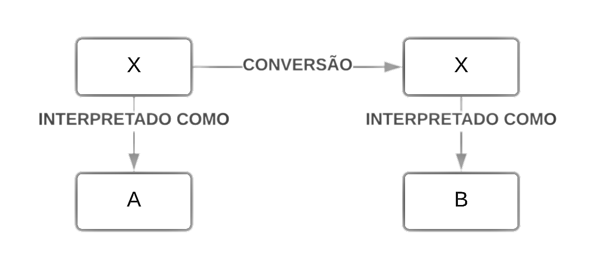
```
\bcenter
Fonte: Fonte: [@snow_sociology_1984]
\ecenter

  Um exemplo prático disso seria quando, no meio pentecostal, o alcoolismo é reinterpretado como ação demoníaca através da gramática pentecostal recém adquirida, ao invés de patologia [@mariz_libertacao_1994]. 


### Estratégias de Identificação e Mensuração da Conversão Religiosa

  A discussão até então feita mostra como as pesquisas lidam com a Conversão enquanto elemento subjetivo ou como fenômeno aonde a subjetividade desempenha um grande papel. Foi destacada também a sinergia entre agência e estrutura e como cada um desses age no processo aqui discutido. O conjunto dessas implicações levam grande parte das pesquisas sobre a temática a serem de ordem qualitativa, dado que se torna mais fácil capturar todas as nuances da questão com essa metodologia. O uso frequente dessa técnica, no entanto, gerou uma grande lacuna sobre como discutir isso do ponto de vista quantitativa, ou como gerar dados mensuráveis sobre este fenômeno. Irei gastar algumas linhas neste final de seção para endereçar essa problemática, como ela vem sendo trabalhada e como ela será trabalhada nesta pesquisa em especial.

  Pode-se destacar três tipos de indicadores empíricos, logo passíveis de mensuração, de conversão religiosa utilizados pela pesquisa sociológica: filiação, demonstração e retórica [@snow_sociology_1984,171]. A primeira tática, e talvez a mais simples, se baseia na consideração da conversão enquanto mudança de religião/culto, logo a simples refiliação seria o suficiente para categorizar um indivíduo como convertido. Essa técnica era bastante comum nos estudos iniciais [@newport_religious_1979; @roof_denominational_1979]. Apesar de prático vários outros aspectos da conversão que foram debatidos até então ficavam de fora ao considerar a simples filiação como indicador. Esse tipo de classificação logo caiu em desuso.

  O segundo tipo, demonstrações, é um dos mais empíricos e se baseia na consideração de manifestações públicas de fé, por exemplo, testemunho, repouso no espírito, glossolalia, batismo etc. como _proxies_ de conversão. Essas demonstrações, no entanto, não são necessariamente indicativos. Na maioria das vezes elas dizem mais respeito a atos de reavivamento/reafirmação do que Conversão em si [@snow_sociology_1984,172]. Em suma por mais que essas atitudes possam ser feitas por pessoas que sejam convertidas, não quer dizer que quem as faça seja, necessariamente, convertido.

  O último indicador, o retórico, é o que mais ressoa com as pesquisas mais recentes, dado que levam em consideração a agência do indivíduo e se baseia em elementos discursivos presentes nas falas de pessoas convertidas. Ele é fundamentado em quatro pontos: 
  
> 1.	reconstrução biográfica;
2.	vocabulário de motivos;
3.	suspensão do pensamento analógico;
4.	adoção do papel de convertido. [@snow_sociology_1984,174-175] 

  Inicialmente se tenta perceber se o sujeito reconstrói a sua biografia a partir do universo de discurso da nova fé (1\textordmasculine ponto) , o próximo passo é avaliar se existe a absorção deste vocabulário e o uso dele no cotidiano (2\textordmasculine ponto), seguido de um sentimento de exclusividade nessas percepções mundanas, de modo que a forma como se interpreta o espaço ao redor é incompatível com lógica não religiosa (3\textordmasculine ponto). Por fim se estabelece um modo de ser/estar no mundo guiado pelos direcionamentos do culto/religião (4\textordmasculine ponto). Apesar de robusto esse modelo foi desenhado com base em um estudo sobre um único culto, logo carece de suporte empírico sobre seu funcionamento [@snow_sociology_1984,175].

  A existência desses compilados de indicadores, no entanto, não significa que eles possam ser aplicados em todos os casos possíveis. Especificidades do caso brasileiro, por exemplo, não parecem ser plenamente contempladas em nenhum destes três citados anteriormente. O processo se torna ainda mais difícil quando não se tem pesquisas no mesmo contexto nacional que tenham enfrentado problema similar e possam apontar soluções. O desafio é encontrar ou construir uma opção que leve em consideração as especificidades/subjetividades envolvidas nessa questão ao mesmo tempo que não se ignora as questões estruturais da conversão. Para isso o primeiro trabalho foi o de identificar elementos comuns nos modelos e definições para então descobrir quais poderiam ser transformados em indicadores empíricos da Conversão Religiosa. 

  Segundo Snook et al. [-@snook_issues_2019] existem dois pontos que estão presentes em grande parte das definições de Conversão Religiosa: _mudança de percepções pessoais_ e _melhorias de vida_. O primeiro quesito é perceptível em grande parte das definições aqui abordadas e também é levada em consideração nos modelos. O segundo item é originado do anterior e apoiado por várias pesquisas que apontam os benefícios da Conversão [@cerqueira-santos_religiao_2004-1; @krause_stress_2011; @verona_explanations_2011; @mariz_libertacao_1994; @potter_growth_2016].
  
  Ambos os itens, apesar de subjetivos, compartilham uma característica importante para o desiderato desse estudo: podem ser analisados de forma objetiva através do contraste entre o período anterior a Conversão e o período posterior. Somando esses itens a pergunta direta sobre Conversão é possível detalhar mais o processo vivenciado pelo sujeito que se diz convertido.

  Uma segunda estratégia é seguir o modelo de Gooren [-@gooren_reassessing_2007-1], de forma que a pergunta sobre conversão sai da dualidade (sim/não) e adota mais opções que condigam com as fases da conversão (pré-afiliação, afiliação, conversão, confissão e desfiliação). Apesar de adotar mais opções formular a pergunta seguindo este modelo permitirá que se observe de forma mais efetiva em qual parte do ciclo o respondente se encontra e a partir disso.
  
  Apesar de possíveis, ambas as opções não encaixariam muito bem na realidade nacional e seriam difíceis de captar. Em ordem de sanar essa problemática preferiu-se adotar a definição de Gooren com algumas modificações. Ao invés de assumir as fases da conversão preferiu-se criar uma opção que lida com a "área cinza". Admitindo que a Conversão é um processo estabelece-se um meio ponto entre ser convertido (1) e não ser (0) intitulado _Estou em processo de conversão_ (0.5). Longe de atribuir uma fase na qual o respondente está se prefere entender que ele admite estar em um estado de semi pertencimento, assim é possível capturar, ao mesmo tempo, a noção plena de Conversão e elementos negociáveis que a permeiam.  

\pagebreak


## As Comunidades Terapêuticas

  Comunidades Terapêuticas (doravante CT’s) podem ser definidas de forma genérica enquanto centros de terapia focados na recuperação _(recovery oriented)_ de indivíduos que escolhem por livre e espontânea vontade receberem tratamento para males de ordem mental baseado em vivência comunitária (também chamada de “entre pares”) e na transformação de hábitos e comportamentos. Elas estão presentes atualmente em mais de 60 países [@avery_current_2019,87] e possuem público extremamente variado, sendo esta variação um dos elementos chave para a construção e reconstrução dos tipos de CT’S. Atualmente os principais modelos empregados são os _Baseados em Justiça Criminal_, _Baseado nos 12 passos_, _Religioso_, _Democrático_ e _Modificado_, cada um destes com suas próprias variações internas [@avery_modern_2019,37]. 

  Esses diversos modelos, no entanto, podem ser divididos por uma linha em dois grandes grupos: _Democráticos_ e _Exclusivo para Dependentes Químicos_ sendo o nível de liberdade e poder hierárquico, especificamente o nível de horizontalidade entre administração e internos, o que os define. Neste estudo o foco será dado para o segundo tipo de \acrshort{CT}, dado que ela é a que predomina no Brasil.

  Essa variação gera uma das primeiras discussões a serem feitas neste capítulo: Como esses modelos se comportam? O que uma pessoa que opta por um deles irá encontrar? O que aproxima e distancia cada tipo de CT? Existiria algum tipo de predominância ou preferência? Se sim, como ela se manifesta? Outro ponto importante é avaliar como essas instituições se instalam em solo brasileiro: Quais adaptações elas sofrem ao chegar aqui? Qual seu estilo, seus itinerários, suas características e seu nível de aproximação com outras instituições, sejam elas públicas ou privadas/ Essas questões e outras mais serão discutidas neste subcapítulo e no próximo, aonde uma linha do tempo para o caso brasileiro será oferecida. 

### Características Gerais das CT’s

  O modelo “padrão” de CT surgiu no período pós Segunda Guerra Mundial a partir do trabalho de Maxwell Jones sobre stress pós combate entre soldados [@smart_outcome_1976; @jones_therapeutic_1953] e era definido como um modelo focado na recuperação de indivíduos através da vivência comunitária (também chamada de “entre pares”) e na transformação de hábitos e comportamentos. Mesmo tendo sido criado no século XX era possível encontrar instituições com modos similares já no século XVIII. Criada pelos Tuke, uma família de comerciantes quakers, _The Retreat_ tinha como principal público os chamados “insanos”. Nesse lugar era aplicado o chamado _Tratamento Moral_. Baseado em princípios humanitários e religiosos o Retiro^[Tradução literal de _The Retreat._] concedia ao paciente a chance de experimentar os confortos de uma “boa vida” e da presença de “relacionamentos amigáveis” [@whiteley_evolution_2004,234] ao mesmo tempo que mantinha contato com princípios da doutrina Quaker, como “produtividade física e mental”, visando a produção de uma moral ressocializadora que era a base do “Tratamento Moral” empregado [@mcbride_advancement_2017,05].

  Como dito anteriormente, existem cinco modelos de CT’s que possuem variações específicas. Tais variações surgem em ordem de acomodar melhor o público e pelas modificações operadas na teoria central através do contato com novas informações ou formas de cuidado, o que cria processos de hibridização [@avery_modern_2019,36]. A tabela abaixo resume cada um desses tipos, assim como suas características e subtipos.


```{r, warning=FALSE, message=FALSE, echo=FALSE}
modelo <- c("Religiosa", "12 Passos", "Modificada", "Justiça Criminal", "Democrática")

desc <- c("CT’s que fazem uso da fé/religiosidade/espiritualidade como parte central do tratamento.", "CT’s que fazem uso das metodologias do AA/NA como parte central do tratamento.", "CT’s que se adaptam a novas terapias e públicos","CT’s que fazem parte do sistema de justiça e atendem público que tem como parte da pena a participação em Comunidades", "CT’s que fazem uso de técnicas do Serviço Social ou Psiquiatria")

sub <- c("Cristã Católica, Cristã Ortodoxa, Cristã Protestante, Mulçumana, Hinduísta","AA; NA", "Adolescentes, Duplo diagnóstico", "Comunidades em Prisões, Menores infratores, Comunidades para prisioneiros", "Teoria dos Sistemas, Psicanalítico, Comunidades em Prisões")

tab1 <- cbind (modelo,desc,sub)
```

\setcounter{table}{0}

```{r ct, warning=FALSE, message=FALSE, echo=FALSE}
library(knitr)
library (kableExtra)

kable (tab1, format = "latex", booktabs = TRUE,
      caption = "Descrição dos tipos existentes de Comunidades Terapêuticas geradas a partir de Hibridização.", col.names = c("Modelo", "Descrição", "Subtipos/Públicos")) %>%
  kable_styling(latex_options = "HOLD_position") %>% 
  column_spec(1,width = "1.5in") %>%
  column_spec(2,width = "2.8in") %>%
  column_spec(3,width = "2in") %>%
  row_spec(0, bold = TRUE)

```

\bcenter
Fonte: [@avery_modern_2019]
\ecenter


  Apesar dessa divisão bastante estrita é possível ainda subdividir esses grupos em dois grandes tipos: _Democrático_ e _Exclusivo para dependentes químicos_.

  O primeiro é mais comum nos países do continente europeu e tem como maior característica, como o próprio nome indica, o seu caráter democrático no qual os chamados residentes possuem um grande papel na tomada de decisões e são estimulados a desenvolverem habilidades sociais através da promoção de valores como cidadania, empoderamento pessoal, responsabilidade coletiva e liderança carismática. A hierarquia nesse tipo de CT tende a ser mais flexível [@campling_therapeutic_2001; @smart_outcome_1976] e o público atingido por esse modelo tende a ser bastante amplo, sendo encontrada na literatura evidências de sua aplicação em, por exemplo, crianças e adolescentes que passaram por eventos traumáticos [@diamond_mulberry_2013] e Detentos [@rawlings_therapeutic_2017]. Se encaixam nesse escopo os modelos Modificado, Democrático e Baseado em Justiça Criminal.

  Já o segundo tipo, formado pelos 12 Passos e Religiosos, é mais comum na América, principalmente nos Estados Unidos (aonde foi criado) e em alguns países da América Latina, incluindo o Brasil. Ele tende a ser o oposto do modelo Democrático e tem como principais características o foco na geração de mudança comportamental, programa terapêutico construído com base num esquema de recompensas e graus, forte obediência a uma hierarquia rígida e bem delineada, sistema de confronto direto e uso de modelos explicativos simples da dependência química e do tratamento [@campling_therapeutic_2001,365]. Ele surge a partir do Programa Synanon criado por Charles Dederick em 1958, e tem sua origem no chamado Grupo de Oxford, que também foi precursor dos Alcoólicos Anônimos (\acrshort{A.A}). O Grupo era uma organização religiosa fundada pelo Dr. Frank Nathan Daniel Buchman em 1921 sendo majoritariamente constituída por alcoólatras e que tinha como principal missão provocar o “renascimento espiritual da humanidade” [@glaser_origins_1981,16]. 

  Tal modelo teve várias vezes seu caráter terapêutico questionado, dada a presença de forte hierarquia e a existência de admissão forçada de internos [@smart_outcome_1976,145] sendo a própria Synanon, por exemplo, obrigada a fechar as portas em 1991 após Charles Dederick transformar seu programa terapêutico em uma espécie de “residência alternativa”, na qual foram relatados casos de abuso infantil e tentativa de assassinato de internos que não concordavam com a hierarquia interna [@mitchell_light_1980,30].

  É perceptível ao olhar a linha evolutiva das CT’s como um todo, e especialmente nos modelos Exclusivos para Dependentes Químicos, o quanto a Religião é um elemento presente e que permeia as práticas por ela adotadas. Tanto Charles Dederick quanto o Dr. Frank Buchman alegam terem vivenciado experiências místicas que os conduziram na criação de seus trabalhos terapêuticos [@glaser_origins_1981,16]. Elementos gerais do Cristianismo e específicos de algumas doutrinas costumam quase sempre ser infundidos no _milieu_ terapêutico oferecido por estas instituições. No Grupo de Oxford, por exemplo, a Conversão Religiosa era não apenas incentivada como também era um dos quatro pilares do “tratamento”. A mudança provocada por ela livraria o indivíduo de todo pecado, e como consequência prática, do uso abusivo de drogas [@glaser_origins_1981,18]. Tal visão ainda persiste em uma parte das CT’s, principalmente nas ditas “Religiosas”, nas quais a Conversão tende a ser considerada peça chave para a Recuperação [@chu_religious_2012,198; @mcbride_therapeutic_2018,167]. 

### Comunidades Terapêuticas no Brasil

  No Brasil, como dito em parágrafos anteriores, é comum a existência de Comunidades voltadas exclusivamente para indivíduos que fazem uso abusivo de drogas, sendo ainda mais comuns as ditas “Religiosas”. As primeiras CT’s, _Desafio Jovem_ e _Fazenda do Senhor Jesus_, surgem em território nacional durante as décadas de 60 e 70, sendo a primeira criada em 1968 por um movimento Norte Americano de origem protestante e a segunda em 1978 pelo padre missionário Norte Americano Haroldo Rahm em Campinas - SP [@fossi_o_2015,99]. Desse período em diante elas começam a expandir até que em 1990 é criada a Federação Brasileira de Comunidades Terapêuticas (FEBRACT). Segundo dados do Ministério da Justiça, em 2016 existiam pelo menos 1,830 CT’s ativas e com \acrshort{CNPJ} cadastrado, o infográfico abaixo aponta a distribuição destas pelo país. 

```{r imagem2, fig.cap = "Distribuição das Comunidades Terapêuticas pelo Território brasileiro em 2016.", fig.pos = "H",fig.align='center', out.width="85%", echo=FALSE}
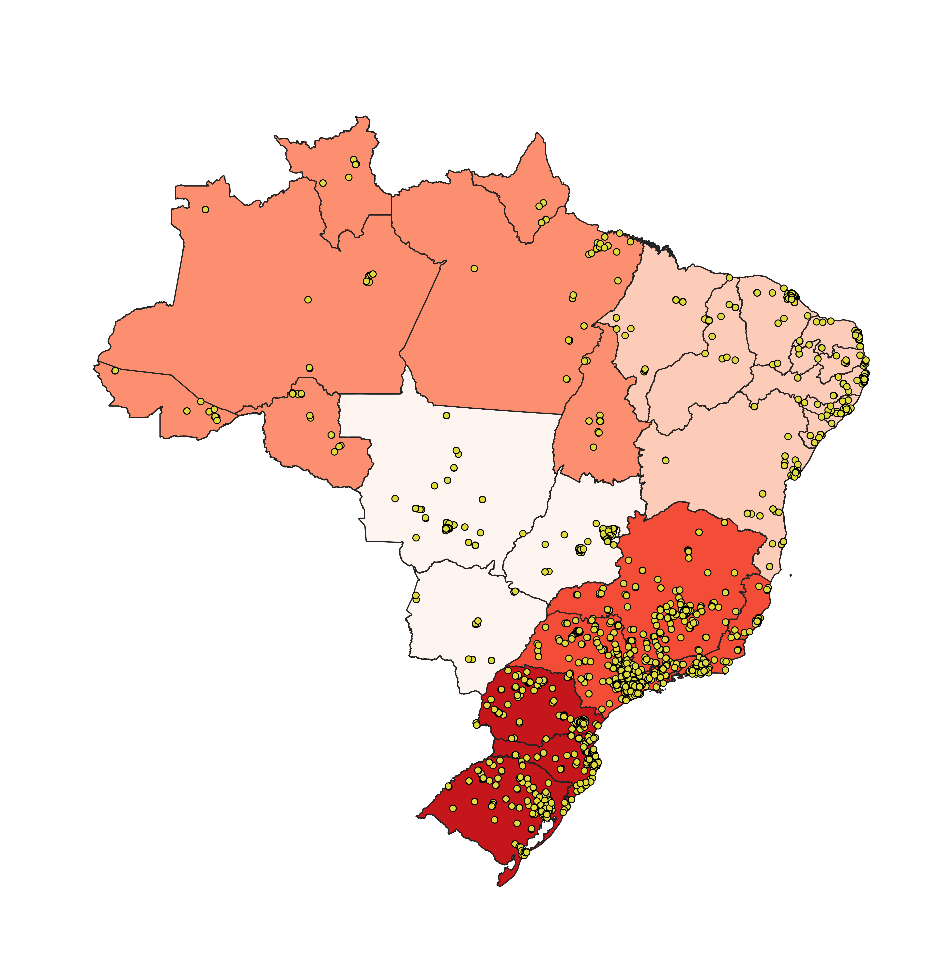
```

\bcenter
Fonte: Ministério da Justiça, 2016
\ecenter

  A maioria das CT’s em 2016 se concentravam nas regiões Sul e Sudeste do país e juntas elas representavam mais de 60% do total existente. Para além dos dados do próprio Ministério da Justiça, uma pesquisa encomendada pelo \acrshort{IPEA} em 2017 intitulada _“Perfil das Comunidades Terapêuticas Brasileiras”_ achou resultado similar. 67% das CT’s por ele pesquisadas por eles provinham dessas regiões. 

#### Gênero

  O Banco de dados do MJ revela ainda que 80% do público que é atendido é masculino e apenas 20% delas aceitavam, seja de forma exclusiva ou parcial, indivíduos do sexo feminino. Esse dado se torna mais preocupante quando se percebe que cada vez mais o uso de substâncias ilícitas deixa de ser um “privilégio” masculino e se torna homogeneizado entre os sexos. Dados da Fiocruz demonstram não haver diferenças significativas entre o uso de substâncias ilícitas quando analisado pelo viés de sexo[@bastos_iii_2017]. Em outras palavras, homens e mulheres se tornam dependentes numa frequência bastante similar [@bastos_iii_2017,133] de forma que dar atenção a um e não a outro além de incoerente pode significar a morte de várias mulheres vítimas deste mal. 
  
  Esse tipo de problemática, também presente no sistema prisional [@cury_mulher_2017], não é apenas sinal de que existe no país um viés de gênero em relação aos métodos de acolhimento e reinserção social, mas que o próprio sistema é desenvolvido com base nessa desigualdade. Ao pesquisar internas de Comunidades Terapêuticas, Targino [-@targino_experiencias_2020, 14] constata em suas narrativas que elas consideram o período de internação e o contato da religiosidade como algo que as faz entrar em contato com a feminilidade e as reensina como ser uma mulher decente que cumpre com seus papeis sociais de mãe/esposa de forma plena, o que é similar ao que tentam incutir na mulher no sistema prisional que, por meio da pena, tentam recobrar seu pudor [@cury_mulher_2017, 02]
  

#### Filiação Religiosa

  Outra característica das CT’s nacionais é a forte presença da Religião e seus elementos. Um dos primeiros demonstrativos disto é que pelo menos 82% dessas instituições são mantidas por igrejas e entidades religiosas, sendo a maioria dela cristãs.

```{r echo=FALSE, warning=FALSE, message=FALSE}
library (tidyverse)

it <- c("Pentecostal", "Católica", "Sem orientação", "Missão", "Outras", "Outras Cristãs")

porc <- c(39.7, 27.1, 17.8, 6.9, 5.8, 2.6)

porcit <- data.frame(it, porc)

#gráfico orientacoes religiosas
g1 <- ggplot (porcit, 
        aes(x = reorder(it,-porc), y = porc), fill = it) +
geom_bar(stat = "identity", fill = uma) +
labs (x = "Filiação",
      y = "%") +
  theme_classic()

```

```{r g1, fig.cap = "Filiação Religiosa das Comunidades Terapêuticas Nacionais.", echo=FALSE, out.width= "100%", echo=FALSE, fig.pos = "H"}

plot (g1)

```
\bcenter
Fonte: [@ipea_perfil_2017-1]
\ecenter

  Para além do fato de serem mantidas por igrejas, duas das dez atividades mais empregadas por CT’s no Brasil tem relação direta com religiosidade. Em 89% delas a Bíblia é lida diariamente e em 88% Orações e Cultos também são feitas com a mesma frequência. Mesmo que tais ações sejam diretamente ligadas com religião (dado que essa Bíblia que é lida e essas orações/cultos que são feitos pertencem a um credo institucionalizado) o relatório os classifica simplesmente como “Espiritualidade”. O foco da análise é direcionado para a prática de ações “técnico-científicas” como atendimento psicoterápico, que costuma aparecer em maior porcentagem [@ipea_perfil_2017-1,22]. O mascaramento da religiosidade sobre o termo guarda-chuva “Espiritualidade”, somada a ênfase nessas atividades “científicas”, são elementos comuns nas narrativas feitas tanto pelas entidades governamentais quanto pelas próprias CT’s. Este assunto será novamente abordado na terceira seção deste capítulo.

```{r, echo=FALSE}

atv <- c("Trabalhos de Agricultura/Pecuária", "Reunião de Sentimentos", "Atendimento Psicoterápico em Grupo", "Atendimento Psicoterápico Individual", "Orações e Cultos", "Leitura da Bíblia", "Trabalhos de Cozinha", "Atividades Físicas ou desportivas", "Palestras Diversas", "Limpeza e Organização das CT's")

p <- c(70.4, 81.9, 82.4, 84.1, 88, 89, 89.5, 90.7, 93.6, 95)


g2 <- data.frame(atv, p)

#gráfico atividades diarias
g2 <- ggplot (g2, 
        aes(x = reorder(atv,-p), y = p)) +
geom_bar(stat = "identity", fill = uma) +
  coord_flip () +
labs (x = "Atividades Diárias",
      y = "%") +
  theme_classic()

```

```{r g2, fig.cap = "Dez Atividades diárias mais praticadas em CT's brasileiras.", echo=FALSE, out.width= "100%", echo=FALSE, fig.pos = "H"}

plot (g2)

```
\bcenter
Fonte:  [@ipea_perfil_2017-1]
\ecenter


  Ainda dentro da questão da religiosidade percebe-se que uma marca desse tipo de tratamento é o incentivo a Conversão Religiosa. Existem pesquisas que alegam a não existência dessa prática [@loeck_dependencia_2014] ou que a abordem de outro ponto de vista. Dentre elas pode-se destacar o próprio relatório do IPEA que alega que a religiosidade no contexto das CT’s não tem como meta principal a Conversão Religiosa do interno e sim “(...) sua conversão moral, onde a fé no divino e o apoio das escrituras sagradas do cristianismo são percebidos como aliados poderosos, seja na proteção contra as recaídas, seja na fixação de uma ética heterônoma de conduta” [@ipea_perfil_2017-1,35]. Esse processo de conversão moral, no entanto, acarreta uma série de operações que geram mudanças de visão de mundo e de significação, não obstante, processos de conversão religiosa. Para além disso, existem pesquisas que demonstram a existência dessa tradição nas CT’s nacionais [@targino_comunidades_2017-1; @targino_experiencias_2020; @mcbride_therapeutic_2018].
  
  Para além de todas estas colocações é válido pontuar que não existem pesquisas ou estudos consolidados que justifiquem ou comprovem o estímulo à Conversão Religiosa enquanto fator que promove resultados positivos para a Recuperação e manutenção da abstêmia, seja em tratamento ou fora dele [@shields_religion_2007,356]. Há, de fato, estudos que ligam religiosidade a menores chances de contato com drogas ilícitas durante a adolescência [@hill_religious_2009] e com baixos níveis de stress, ansiedade e depressão na vida adulta [@krause_stress_2011]. Poucos, no entanto, avaliam a relevância disso em pessoas que já entraram no estado de uso abusivo ou que se submeteram a tratamentos infundidos de religião ou totalmente religiosos [@davis_religious_2014-1; @flynn_looking_2003; @shields_religion_2007; @chu_religious_2012; @perrone_fatores_2019]. Se pesquisas desta alcunha são poucas, menos ainda são as que comparam ou constatam numericamente a eficácia deste modelo em revelia de outros, sendo esses um dos principais motivos que levaram esse modelo a sofrer uma severa queda no decorrer do tempo [@yates_drug-free_2017-1,205; @yates_rise_2017,57]. O que se encontra, apesar disso, são análises que apontam o efeito do uso de Religiosidade neste contexto como algo ambíguo, que pode gerar malefícios na mesma medida, ou que até perpassem, supostos benefícios existentes [@davis_religious_2014-1,256; @williams_spiritual_2016,08].

#### Financiamento Público

  Uma última característica das CT’s nacionais é que desde 2011 elas fazem parte da Rede de Assistência Psicossocial (\acrshort{RAPS}) o que as habilita a receberem por meio da Secretaria Nacional de Política sobre Drogas (\acrshort{SENAD}) financiamento público. Em relação ao número de vagas que são mantidas por meio de custeio de verba do SENAD é perceptível que grande parte delas é destinada as regiões Nordeste e Sudeste do país. O infográfico abaixo demonstra o número de CT’s financiadas apenas pelo Governo Federal por estado, não contabilizando verbas do governo estadual ou municipal.

```{r imagem4, fig.cap = "Quantitativo de Comunidades Terapêuticas financiadas pelo SENAD.", fig.pos = "H",fig.align='center', out.width="85%", echo=FALSE}
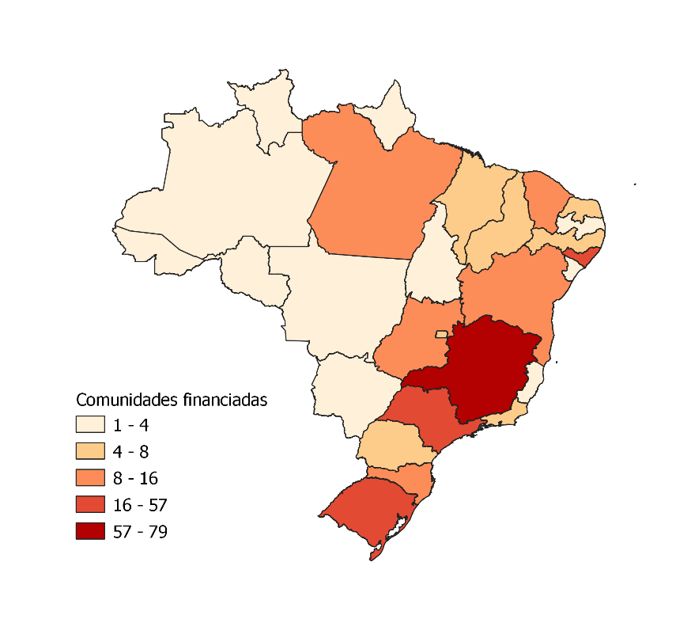

```

\bcenter
Fonte: SENAD, 2019
\ecenter

  Ao se observar, no entanto, a distribuição de vagas por gênero é perceptível que não apenas as CT’s não parecem se importar com a questão como o próprio sistema de financiamento parece apoiar esse tipo de prática. Mais de 80% do financiamento do Governo Federal é destinado única e exclusivamente a homens, sejam eles adultos ou adolescentes. O gráfico abaixo demonstra a distribuição:

```{r echo=FALSE, warning=FALSE, echo=FALSE}
library(readxl)
senad <- read_excel("C:/Users/fapes/Downloads/Comunidades Vigentes SENAD 2019 II - Atualizada até 11.1.19.xlsx")

b <- senad[,(11:12)]
c <- senad[,(13:14)]

fem.d <- subset(b, b$`Adolesc Masc` == 0 & b$`Adolesc Femin` != 0)
masc.d <- subset(b, b$`Adolesc Masc` != 0 & b$`Adolesc Femin` == 0)
fem.a <- subset(c, c$`Adulto Masc` == 0 & c$`Adulto Fem` != 0)
masc.a <- subset(c, c$`Adulto Masc` != 0 & c$`Adulto Fem` == 0)

sex <- c("Masculino", "Masculino", "Feminino", "Feminino")
fx <- c("Adolescente", "Adulto", "Adolescente", "Adulto")
n <- c(24, 274, 5, 28)
gct <- data.frame(sex,fx,n)

g3 <- ggplot(gct,
             aes(x = fx, y = n, fill = sex)) +
  geom_col(position = "dodge") +
  labs ( x = "Grupo Etário",
         y = "Porcentagem",
         fill = "Sexo"
  ) +
  theme_classic() +
  scale_fill_manual(values = duas)
```

```{r g3, fig.cap = "Porcentagem de vagas oferecidas por sexo e faixa etárea nas Comunidades Terapêuticas brasileiras financiadas pela SENAD.", echo=FALSE, fig.pos = "H", out.width= "100%",echo=FALSE}

plot (g3)

```

\bcenter
Fonte: SENAD, 2019
\ecenter

  A decisão de financiamento foi duramente criticada por instituições como os Conselhos Federais de Psicologia (CFP) e de Serviço Social (\acrshort{CFESS}). A principal pauta levantada por eles levantada é a de que esse ação sinalizava uma concordância do governo com o proselitismo promovido pelas CT’s, que se caracteriza principalmente pela mistura de elementos terapêuticos com religiosos, gerando assim uma espécie “fé medicamentada” e no constante apoio da “cura” do sujeito numa conversão do interno ao credo pregado pela instituição [@targino_comunidades_2017-1,79]. Elementos que vão contra a lógica de Redução de Danos até então empregada.

\pagebreak


## Comunidades Terapêuticas e Políticas Públicas

  Como colocado no final da seção anterior, as CT's entram no rol de políticas públicas e começa a ser financiada em 2011. Desse ano em diante elas passaram a interagir com outras entidades, seja para agir em conjunto, seja para entrar em atrito. O resultado final deste longo percurso foi a transformação delas em referências no que diz respeito ao cuidado e tratamento do uso abusivo de drogas no Brasil. 

  Este capítulo se dedica a contar esta trajetória através de uma linha do tempo que se inicia em 2011, com a criação do Programa _“Crack é possível vencer”_ e se estende até 2020, com a promulgação da lei 13.840 que tornou os modelos baseados em abstinência, em outras palavras, Comunidades Terapêuticas, como oficiais. Para isso foram catalogadas e analisadas notícias publicadas online, artigos científicos e jornalísticos, promulgações, leis e relatórios disponibilizados por entidades ligadas ao Governo Federal e as CT’s.
  
  Contudo, antes de iniciar a exposição, é importante entender o que acontecia antes de 2011 e que possibilitou o contato inicial entre ambas as instâncias. O Brasil, assim como o resto do mundo, iniciou suas políticas de combate as drogas no começo do século XX a partir das resoluções da Primeira Conferência Internacional do Ópio [@fiore_o_2012] por meio do Decreto-Lei n\textordmasculine 891, de 25 de novembro de 1938. O que foi precedido, muitos anos depois, em 1980, pela instituição do Sistema Nacional de Prevenção, Fiscalização e Repressão de Entorpecentes, que surge enquanto resposta ao surto de \acrshort{HIV} que acontecia no país dado o compartilhamento de seringas [@andrade_reflexoes_2011-2].

  Em 2006 essas políticas se consolidam através do SISNAD e da lei n\textordmasculine 11.343/2006 que cria a primeira regulamentação para prevenção, atenção e reinserção social de indivíduos com histórico de uso abusivo de drogas e junto com ele outros programas e instituições como o Programa de Redução de Danos (\acrshort{PRD}), o \acrshort{SUPERA} (Sistema para Detecção do Uso Abusivo e Dependência de Substâncias Psicoativas: Encaminhamento, intervenção Breve, Reinserção Social e Acompanhamento) e órgãos exclusivamente dedicados à questão como a \acrshort{SENAD} (Secretaria Nacional de Políticas sobre Drogas), a Coordenação Nacional de Saúde Mental, Álcool e Outras Drogas e os \acrshort{CAPS AD}. Todas estas políticas, inclusive a própria lei de 2006, tinham como diretriz principal a Redução de Danos [@andrade_reflexoes_2011-2]. 

  A partir de 2009, no entanto, uma segunda droga começa a ocupar o cenário nacional e a trazer grandes problemas: o Crack. Por mais que seu uso fosse registrado desde a década de 90 é neste período, graças ao crescimento exponencial, que ela atinge seu ápice, chegando a ser considerada na época um elemento “pandêmico”, sendo inclusive tema de debate presidencial nas eleições de 2010 e parte da agenda política dos candidatos eleitos daquela época [@mattos_crack_2017,198]. 

  As medidas tomadas pelo governo eleito foram a criação do \acrshort{PEAD} (Plano Emergencial de Ampliação do Acesso ao Tratamento e à Prevenção em Álcool e outras Drogas) e do chamado _“Plano Crack”_, que deu origem em 2011 ao programa _“Crack, é possível vencer”_. É a partir deste ano que se pode traçar um divisor de águas entre as políticas empregadas até então pois, junto com esse plano, veio a introdução das Comunidades Terapêuticas, e por sua vez dos religiosos, na política de drogadição. Essas instituições representam o total oposto do que vinha sendo empregado dado que elas funcionam, em sua maioria, em modelos de Abstinência, que representam o inverso dos modelos de Redução de Danos. Somado a isso existem ainda outras questões como o constante uso de elementos religiosos e acusações de proselitismo que feriam os princípios de laicidade que os tratamentos indicados pelo governo mantinham. Todas essas questões geraram, e ainda geram, uma série de embates sobre qual modelo de cuidado era válido e deveria ser usado como padrão, além de questionar quais são os reais limites entre religião e política(s) no Brasil. 

### (2011-2014) Primeiros Contatos

  Demarca-se como ponto de partida desta discussão, como colocado anteriormente, o ano de 2011. Foi neste período que se iniciou um estreitamento nas relações entre Governo Federal e Comunidades Terapêuticas, a partir da instituição do Programa _“Crack é possível vencer”_, sendo estas últimas representadas pela Confederação Nacional de Comunidades Terapêuticas (\acrshort{CONFENACT}). Os seguintes trechos da matéria^[Disponível em: https://tinyurl.com/yagj3nf2] publicada pelo site oficial do Governo Federal em junho de 2011 fornecem mais detalhes sobre o primeiro encontro destas duas entidades:


\begin{quoting}[rightmargin=0cm,leftmargin=4cm]
\begin{singlespace}
{\footnotesize 
  A presidenta Dilma Rousseff determinou a constituição de um grupo de trabalho sob liderança da ministra-chefe da Casa Civil, Gleisi Hoffmann, para preparar legislação que permita a inclusão de comunidades terapêuticas no atendimento aos cidadãos dependentes de substâncias químicas. Dilma se reuniu nesta quarta-feira (22), em Brasília, com representantes das entidades. De acordo com pastor Wellington Vieira, que preside a Federação de Comunidades Terapêuticas Evangélicas do Brasil (Feteb), existem no Brasil cerca de 3 mil comunidades que cuidam de aproximadamente 60 mil dependentes químicos. 'Estas entidades atendem atualmente cerca de 80\% das pessoas que estão em tratamento', disse o pastor Vieira. A titular da Secretaria Nacional de Políticas sobre Drogas (Senad), Paulina Duarte, disse que a reunião atende pedido da presidenta Dilma para conhecer o trabalho desenvolvido pelas comunidades. A partir deste momento, será estabelecido programa que vai incluir as entidades na rede pública para tratamento de dependentes químicos. Assim, estas comunidades passam a receber recursos públicos para prestar serviço.}
\end{singlespace}  
\end{quoting}

```{r imagem5, fig.cap = "Presidenta Dilma Rousseff posa para foto com representantes de Comunidades Terapêuticas, no Palácio do Planalto.", fig.pos = "H",fig.align='center', out.width="85%", echo=FALSE}
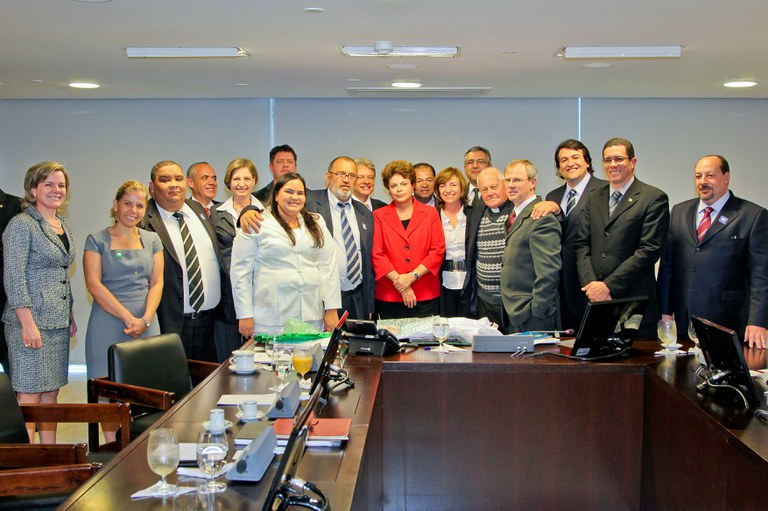

```

\bcenter
Fonte: Biblioteca da Presidência da República^[Disponível em: https://tinyurl.com/ya5jjlpl. Acesso em 06 out. 2019] 
\ecenter

  Esta reunião resultou na promessa de reconstrução da Resolução 101/2001 da Agência Nacional de Vigilância Sanitária (\acrshort{ANVISA}) permitindo assim aumentar o escopo de CT’s que poderiam receber auxílio governamental^[https://rb.gy/qnwos5]. Segundo Duarte:

\begin{quoting}[rightmargin=0cm,leftmargin=4cm]
\begin{singlespace}
{\footnotesize 
Temos uma resolução da Anvisa que estará sendo revista por esse grupo criado esta tarde pela presidenta. É uma resolução que coloca normas mínimas de funcionamento para comunidades terapêuticas. Essa resolução deve ser revista para que se possa atender a nova perspectiva de acolhimento das comunidades, como rede de apoio à rede pública de tratamento \cite{ultimato2011}.}
\end{singlespace}  
\end{quoting}

  Ainda neste encontro nasce a \acrshort{RDC} 029/2011, uma Resolução que ameniza as exigências anteriores. A edição de agosto de 2011^[https://www.senado.gov.br/noticias/Jornal/emdiscussao/dependencia-quimica/sociedade-e-as-drogas/anvisa-ameniza-regras-para-comunidades-terapeuticas.aspx] da Revista Em Discussão, publicada pelo Senado, traz uma matéria sobre a flexibilização. É destacado que: 

\begin{quoting}[rightmargin=0cm,leftmargin=4cm]
\begin{singlespace}
{\footnotesize 
Foram retirados requisitos que, segundo Wellington Dias, eram os principais responsáveis pelas dificuldades das comunidades terapêuticas em obter financiamento público. De acordo com o senador, dois deles praticamente impediam que as comunidades se adequassem às regras: a proibição de que os internos fossem obrigados a participar das atividades religiosas e a exigência de que eles fossem atendidos, pelo menos uma vez por mês, por médico psiquiatra. \cite[p. 67]{discussao2011}}
\end{singlespace}  
\end{quoting}

  Por mais que a criação desta RDC represente um grande passo na entrada das CT’s para financiamento público, só é a partir de 2013 que podemos ver uma efetiva inserção destas nas políticas públicas de combate a drogadição, graças a posse de Vitore Maximiano como Secretário da SENAD. Sua entrada é marcada pela renúncia da secretária anterior, Paulina do Carmo Duarte. Em entrevista à Globo o ministro da Justiça deste período, José Eduardo Cardozo, afirmou que a saída de Duarte foi em parte motivada por pressão do Palácio do Planalto para a liberação de R$ 130 milhões para Comunidades Terapêuticas^[https://www.anadep.org.br/wtk/pagina/materia?id=17172] ^[https://tinyurl.com/y9hx5bew]. Segundo Cardozo, Maximiano “[...] tem uma sensibilidade grande para esse assunto e concordância total com o plano e o papel das Comunidades Terapêuticas”  
	
  As matérias publicadas no período anterior a saída de Duarte ajudam a entender que, de fato, havia uma tensão entre ela e os representantes das CT’s. Neste outro trecho da revista "Em Discussão" podemos presenciar o que parece ser uma manifestação contrária dela em relação a metodologia empregada no tratamento ofertado pelas instituições, Duarte diz:
  

\begin{quoting}[rightmargin=0cm,leftmargin=4cm]
\begin{singlespace}
{\footnotesize
Não posso financiar, com dinheiro público, uma instituição católica que recebe para tratar um evangélico e o obriga a assistir a uma missa. Para essas comunidades, a nossa sugestão é de que seja seguida a metodologia, mas que se dê ao interno o direito de escolha \cite[p. 66]{discussao2011}.}
\end{singlespace}  
\end{quoting}

  Essa fala foi contraposta à de Adalberto Calmon Barbosa, diretor de Projetos da Fazenda da Esperança e um dos principais representantes da inserção das CT’s nas políticas públicas de combate à drogadição, segundo ele:
	
\begin{quoting}[rightmargin=0cm,leftmargin=4cm]
\begin{singlespace}
{\footnotesize
A ideia não é converter quem quer que seja. Não ensinamos religião. Ensinamos respeito, amor, responsabilidade. Mas é preciso que o interno esteja com o grupo, que participe. Não podemos deixá-lo sozinho, ainda que ele queira”. A Fazenda da Esperança abriu mão de participar do edital por “não poder prescindir de sua filosofia e métodos \cite[p.66]{discussao2011}.}
\end{singlespace}  
\end{quoting}

  A entrada de Maximiano é marcada por uma aproximação deste com representantes das CT’s, assim como uma preocupação dele com auxiliar estas instituições, seja no repasse de verba^[https://tinyurl.com/ycpfxxt7] ou na criação de aporte legal para estas instituições.
  
  
```{r imagem6, fig.cap = "Secretário Vitore Maximiano com o Dep. Federal Ronaldo Benedet, defensor do modelo das comunidades terapêuticas.", fig.pos = "H",fig.align='center', out.width="60%", echo=FALSE}

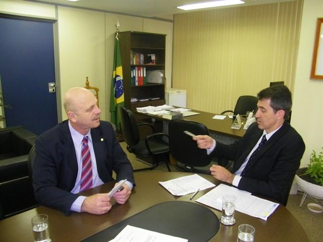
```

\bcenter
Fonte: Blog Drogas e Direitos Humanos^[Disponível em: drogasedireitoshumanos.org/2013/08/08/na-contramao-senad-mantem-acordo-com-comunidades-terapeuticas-secretario-afirma-que-esta-investindo-em-rede-alternativa-de-tratamento-fora-do-sus/. Acesso em 06 out. 2019]   
\ecenter


```{r imagem7, fig.cap = "Secretário Vitore Maximiano com o Padre Haroldo Rohm, fundador da Fazenda da Esperança e membro ativo da CONFENACT.", fig.pos = "H",fig.align='center', out.width="60%", echo=FALSE}


```
  
\bcenter 
Fonte: Blog Drogas e Direitos Humanos^[Disponível em: https://tinyurl.com/ycpfxxt7. Acesso em 06 out. 2019] 
\ecenter


  A CONFENACT, em postagem datada de 2014 e assinada por Egon Schluter, secretário da instituição, menciona as ações de Maximiano a favor da causa:


\begin{quoting}[rightmargin=0cm,leftmargin=4cm]
\begin{singlespace}
{\footnotesize
Célio Barbosa, presidente, fez um pequeno histórico da parceria construída junto ao Governo Federal, onde o apoio da presidente Dilma, tem sido um marco para o trabalho das CT’s. \textbf{Da mesma forma a SENAD, através do Dr. Vitore Maximiano, tem sido grande parceiro do segmento, colocando em prática o compromisso de apoio da presidência}. Adalberto Calmon, vice-presidente, destacou a necessidade da continuidade da parceria, com a construção de uma política de estado, com a integração da modalidade de CT’s de forma efetiva e concreta na política pública sobre drogas. A pauta principal da audiência foi a continuidade da parceria do Governo Federal com as Comunidades Terapêuticas, com o financiamento de vagas de acolhimento. \textbf{Segundo Ministro José Eduardo Cardoso e Dr. Vitore Maximiano, secretário nacional da SENAD, estão assegurados no orçamento de 2015 recursos para os atuais e novos contratos que serão firmados com as entidades. Foi destacado por estes, o incremento do orçamento da SENAD de 2015 para fazer frente a demanda no acolhimento em CT’s, bem como projetos na área da prevenção, rede de apoio de familiares de dependentes e reinserção social} \cite[grifo meu]{confenact2014}}
\end{singlespace}  
\end{quoting}


```{r imagem8, fig.cap = "Membros da CONFENACT em encontro com o Ministro da Justiça José Eduardo Cardoso e o Secretário Vitore Maximiano.", fig.pos = "H",fig.align='center', out.width="60%", echo=FALSE}

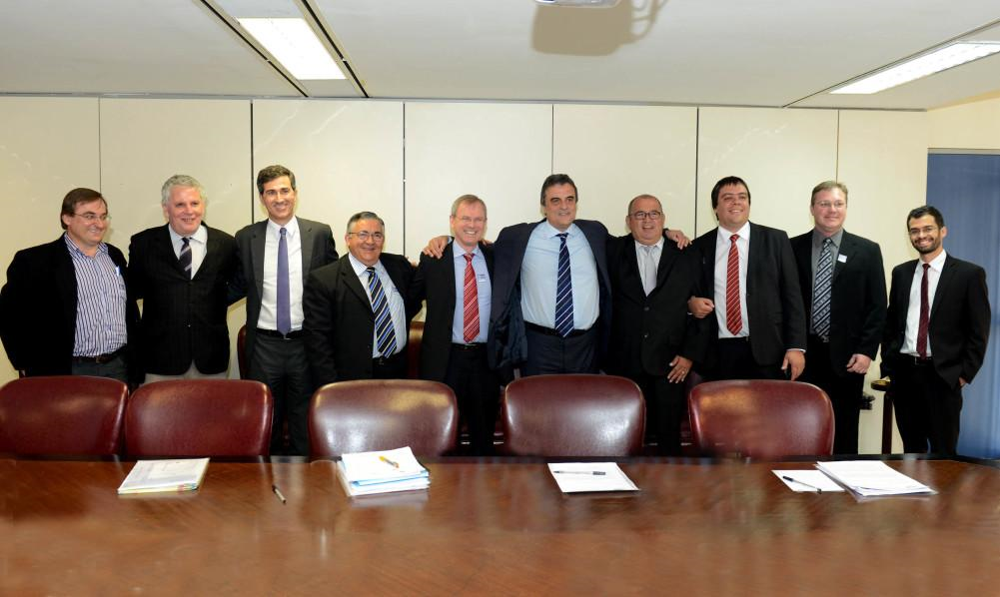
```

\bcenter 
Fonte: Sítio da CONFENACT^[Disponível em: www.confenact.org.br/?p=162, acesso em 06 out. 2019] 
\ecenter

  Para além de Maximiano, outro ator de grande importância para a causa é o deputado Eros Biodini (PTB/MG), que foi fundador da Frente Parlamentar das Comunidades Terapêuticas e da Associação de Proteção e Assistência ao Condenado - APAC´s. Esta frente foi criada em 2011 pelo mesmo deputado e foi reinstalada em 2015, anos que marcam acontecimentos estratégicos na relação entre apoiadores das CT’s e o Governo Federal. A Frente conta com 198 deputados e 23 senadores das mais diversas siglas, como mostra o gráfico abaixo. 

```{r, echo=FALSE}


part <- c("PPL", "PATRIOTA", "PSOL", "PHS", "PPS", "PSL", "SOLIDARIEDADE", "AVANTE", "PC do B", "PROS", "PSC", "PDT","PRB", "PODE", "DEM", "PSB", "PTB", "PR","PSD", "PSDB", "PP", "MDB", "PT")

freq <- c(1,2,2,3,3,3,3,4,4,4,4,5,6,9,10,10,11,14,18,18,19,22,23)

partf <- data.frame (part,freq)

#gráfico membros da APACS por partido
g4 <- ggplot (partf, 
        aes(x = reorder(part,-freq), y = freq)) +
geom_bar(stat = "identity", fill = uma) +
  coord_flip () +
labs (x = "Partido",
      y = "Frequência") +
  theme_classic()

```


```{r g4, fig.cap = "Frequência de participantes (por partido) da Frente Parlamentar das CT's e APAC’S.", echo=FALSE, out.width= "100%", fig.pos = "H"}

plot (g4)

```

\bcenter 
Fonte: Câmara dos Deputados^[Disponível em: https://www.camara.leg.br/internet/deputado/frenteDetalhe.asp?id=385] 
\ecenter

  
```{r imagem9, echo = FALSE, fig.cap = "Frente Parlamentar no Congresso Nacional de Apoio as Comunidades Terapêuticas e APAC´S.", fig.pos = "H",fig.align='center', out.width="60%" }

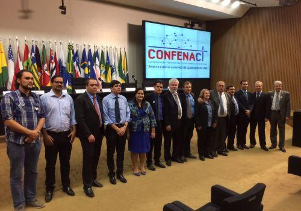
```

\bcenter
Fonte: Sítio da Cruz Azul^[Disponível em: www.cruzazul.org.br/novidade/93/criada-frente-parlamentar-no-congresso-nacional-de-apoio-as-comunidades-terapeuticas-e-apac%C2%B4s. Acesso em 06 out. 2019]
\ecenter

  Um grande feito da gestão de Maximiano foi a construção do "Marco Regulatório das Comunidades Terapêuticas" a partir da resolução CONAD N\textordmasculine 01/2015. A partir deste Marco as CT’s foram regulamentadas e reconhecidas enquanto parte do Sistema Nacional de Políticas Públicas sobre Drogas (SISNAD)^[http://www.politicasobredrogas.pr.gov.br/arquivos/File/CONAD_01_2015.pdf]. A CONFENACT celebrou a instauração dele na seguinte postagem em seu blog oficial:

\begin{quoting}[rightmargin=0cm,leftmargin=4cm]
\begin{singlespace}
{\footnotesize
O dia 06 de maio de 2015 entrará para a história do movimento das Comunidades Terapêuticas do Brasil: FOI APROVADO PELO CONAD – Conselho Nacional de Políticas sobre Drogas – o MARCO REGULATÓRIO DAS COMUNIDADES TERAPÊUTICAS DO BRASIL. Diversas reuniões e contatos foram realizadas neste ano e no ano passado em Brasília, junto a SENAD e CONAD no sentido de construir e consolidar o Marco Regulatório. Todas as ações e iniciativa em prol da construção do mesmo, bem como aprovação partiram da Confederação Nacional de Comunidades Terapêuticas – CONFENACT em parceria com a SENAD, que tem a frente o Secretário Nacional da SENAD, Dr. Vitore André Zílio Maximiano. A CONFENACT, integrada pelas Federações (FETEB, FENNOCT, CRUZ AZUL NO BRASIL, FEBRACT e FNCTC) participou ativamente de todas as ações, reuniões, contatos e discussões em Brasília em prol, da aprovação do Marco Regulatório, e continua na luta pelo reconhecimento e valorização das Comunidades Terapêuticas no Brasil \cite{confenact2015}}
\end{singlespace}
\end{quoting}

### (2014-2016) Impasses

  Este Marco, no entanto, foi revogado em agosto de 2016 pela Justiça Federal do Estado de SP. Tal revogação é resultado de uma série de ações provenientes de instituição que se colocaram contra a entrada das Comunidades Terapêuticas no SISNAD e em seu financiamento público. Entidades como Conselho Federal de Psicologia (CFP), Rede Nacional Internúcleos da Luta Antimanicomial (RENILA), Procuradoria Federal dos Direitos do Cidadão (PFDC) emitiram seus posicionamentos oficiais sobre esta questão. Seguem trechos destes abaixo:

\begin{quoting}[rightmargin=0cm,leftmargin=4cm]
\begin{singlespace}
{\footnotesize 
A proliferação maciça das Comunidades Terapêuticas, atualmente parece indicar insuficiente expansão, organização e capacitação das redes de saúde e assistência social para o cuidado de pessoas que usam drogas. Neste sentido, justifica-se um posicionamento contrário ao financiamento público das Comunidades Terapêuticas, em defesa veemente do necessário aumento de recursos para investimento na RAPS. \cite[p.03]{cfp2014}}
\end{singlespace}
\end{quoting}

\begin{quoting}[rightmargin=0cm,leftmargin=4cm]
\begin{singlespace}
{\footnotesize
Há muito, a RENILA , em coro com várias outras organizações de defesa dos direitos humanos, da saúde pública e com movimentos antiproibicionistas, vem denunciando a profunda indiferença do governo com as deliberações expressas dos movimentos sociais no país a não participação das Comunidades Terapêuticas no âmbito dos serviços públicos de atenção às populações usuárias de drogas. Em contrário ao preceito fundamental da participação social no âmbito das políticas de saúde e da legitimação democrática das políticas públicas promovidas pelo Estado, o governo ignora a disposição contrária ao financiamento público das Comunidades Terapêuticas e sua inclusão na rede de serviços do Sistema Único de Saúde (SUS), conforme disposto na IV Conferência Nacional de Saúde Mental e na XIV Conferência Nacional de Saúde. Mais uma vez, no decorrer da criação do Grupo de Trabalho do Conselho Nacional de Políticas sobre Drogas (CONAD), voltado à criação da Resolução de Regulamentação das Comunidades Terapêuticas, observamos a repetição de um processo apenas formalmente democrático, de construção envolvendo atores restritos, com prazos apertados e a baixa participação de segmentos interessados na participação da construção das proposições que resultaram na minuta de regulamentação agora em consulta pública: notadamente, os usuários e destinatários da política de acolhimento e internações nas Comunidades Terapêuticas foram os ilustres ausentes do processo de construção das disposições e parâmetros para definição de quais são as entidades financiadas, quais são os critérios para a prestação dos serviços, quais são os direitos a serem observados e garantidos nessas instituições \cite[p. 01]{renila2014}.}
\end{singlespace}
\end{quoting}
	
  Dentro do escopo de críticas tecidas às atitudes da CONAD, se destacam a vinculação das CT’s dentro da SISNAD enquanto órgãos apartados do Sistema Único de Saúde (\acrshort{SUS}), a questão manicomial e o proselitismo religioso.  
	
  Como foi trabalhado no tópico anterior, a RDC 29 introduziu uma série de flexibilizações no trato político das CT’s, assim como deu a elas mais liberdade de ação. Um dos grandes problemas para a entrada destas no circuito do financiamento público eram as restrições que lhe assemelhavam ao SUS, isso pode ser destacado no seguinte trecho de uma das reportagens da "Em Discussão" sobre a RDC:
	
\begin{quoting}[rightmargin=0cm,leftmargin=4cm]
\begin{singlespace}
{\footnotesize
Frei Hans Heinrich Stapel, fundador da Fazenda da Esperança, rede católica de comunidades com 52 unidades no Brasil, explica: ‘Eu rejeitei. Sabem por quê? Porque não entendem a comunidade terapêutica.\textbf{Querem fazer de nós um hospital, o que não somos} \cite[p. 66, grifo meu]{discussao2011}}
\end{singlespace}
\end{quoting}

  A solução encontrada pela RDC para proporcionar essa flexibilização era tornar as CT’s uma espécie de _apoio_ ao SUS, não uma parte integrante dele, como é possível nas considerações iniciais do documento:

\begin{quoting}[rightmargin=0cm,leftmargin=4cm]
\begin{singlespace}
{\footnotesize
CONSIDERANDO que as entidades que realizam o acolhimento de pessoas com problemas associados ao uso nocivo ou dependência de substância psicoativa não são estabelecimentos de saúde, mas de interesse e **apoio** das políticas públicas de cuidados, atenção, tratamento, proteção, promoção e reinserção social; \cite{brasil2015}}
\end{singlespace}
\end{quoting}

  A Procuradoria Federal dos Direitos do Cidadão (PFDC) em fevereiro de 2015 enviou um ofício^[pfdc.pgr.mpf.mp.br/temas-de-atuacao/saude-mental/atuacao-do-mpf/oficio-125-2015] ao então presidente da CONAD, José Eduardo Cardozo, no qual destaca a necessidade das CT’s serem avaliadas e reguladas pelo próprio SUS, dada a natureza de suas ações, como é destacado pelos pontos 6 e 7 do documento:

\begin{quoting}[rightmargin=0cm,leftmargin=4cm]
\begin{singlespace}
{\footnotesize
6.	As denominadas comunidades terapêuticas, com ou sem fim lucrativo, estão no setor privado da economia. O SUS vale-se do setor privado da economia, de forma suplementar, para cumprir seu dever constitucional e legal, mediante convênios e contratos. Assim é o SUS que deve, cumprindo seu dever de gerir a Saúde Pública, regular a forma de prestação de serviços daquelas entidades privadas (comunidades terapêuticas ou não) de acordo com a planificação da prestação das ações e serviços públicos de saúde que está a seu cargo.
7.	Nesse sentido, a Portaria n\textordmasculine 3.088, de 23 de dezembro de 2011, do Ministério da Saúde, (Rede de Atenção Psicossocial-RAPS, artigo 5\textordmasculine, IV) define “Serviços de Atenção em Regime Residencial, entre os quais Comunidades Terapêuticas”. \textbf{Entende-se assim que as Comunidades Terapêuticas deveriam ser tratadas, quando for o caso, como equipamentos do SUS, e não como “apoio”, como está sendo disposto na minuta} \cite[p. 02, grifo meu]{pfdc2015}}
\end{singlespace}
\end{quoting}

  O Conselho Federal de Serviço Social (CEFSS) também se manifestou sobre a situação, se opondo ao Marco e ao financiamento. Em seu posicionamento oficial^[Disponível em www.cfess.org.br/arquivos/comunidade-terapeutica-2014timbradocfess.pdf] eles apontam várias incoerências presentes no documento:

\begin{quoting}[rightmargin=0cm,leftmargin=4cm]
\begin{singlespace}
{\footnotesize
A minuta está permeada de contradições, pois, se no ‘considerando’ acima citado, há uma clara e inequívoca ‘tentativa’ de caracterizar as “Comunidades Terapêuticas” como local de mero acolhimento, já em seu artigo 4\textordmasculine é determinada uma exigência própria e específica de serviços típicos de saúde. De acordo com a proposta: 
Art. 4\textordmasculine A instalação e o funcionamento de entidades que promovem o acolhimento de pessoas com problemas decorrentes do abuso ou dependência de substância psicoativa, denominadas ou não de comunidades terapêuticas, ficam condicionados à concessão de alvará sanitário ou outro instrumento congênere de acordo com a legislação sanitária específica aplicável a essas entidades. 
Todos os serviços que prestam atendimento à saúde da população requerem alvará sanitário, como objetivo de assegurar que disponha de condições mínimas para atendimento e permanência daqueles que recorrem aos serviços. Apesar de a própria resolução não caracterizar as “comunidades terapêuticas” como serviços de saúde, estas se propõem a realizar institucionalização/acolhimento e, portanto, não caberia a previsão de uma legislação sanitária específica para estas entidades \cite[p.03]{cfess2014}.}
\end{singlespace}
\end{quoting}

  Por fim o Núcleo Especializado de Cidadania e Direitos Humanos (NECDH) do estado de São Paulo também se posiciona contra o Marco, alegando que a categoria _apoio_ vai contra uma série de premissas da saúde básica, para ele:

\begin{quoting}[rightmargin=0cm,leftmargin=4cm]
\begin{singlespace}
{\footnotesize
(...) o que não podemos aceitar é que a caracterização como equipamentos de ‘apoio aos sistemas de saúde e assistência social’ retire dessas instituições a responsabilidade de atuar segundo os parâmetros normativos dessas políticas públicas, e até mesmo de forma contrária às suas diretrizes, o que implica em não prestar contas perante os órgãos de fiscalização competentes na exata medida da complexidade do atendimento a que se propõem: um atendimento de internação na qual se retira o usuário de drogas de seu convívio, restringindo-se um dos direitos mais caros à humanidade, o direito à liberdade, com o fim de ‘tratamento’. Somente a título de comparação, equipamentos do Sistema Único de Assistência Social (SUAS) que acolhem pessoas nos moldes descritos acima, tais como serviços de acolhimento institucional (tanto para crianças e adolescentes quanto para adultos) são considerados pela política pública como sendo de ‘alta complexidade’ \cite[p.03]{necdh2014}.}
\end{singlespace}
\end{quoting}

  A questão manicomial é outro ponto defendido pelos que se posicionam contra as CT’s. A Associação Brasileira de Saúde Mental (ABRASME), em sua nota sobre o Marco, deixa clara a associação entre as instituições e o modelo manicomial, segundo a ABRASME:

\begin{quoting}[rightmargin=0cm,leftmargin=4cm]
\begin{singlespace}
{\footnotesize
As comunidades terapêuticas vão de encontro com a Lei 10.216/2001 por ter como dispositivo central o isolamento social e a internação, além de ser um equipamento privado, que tem em sua maioria uma fundamentação de cunho religioso. No entanto, sejam de fundamentação religiosa ou médica, as CT´s têm sido inspiradas num modelo de internação compulsória e violação dos direitos das pessoas em tratamento. Essa situação de financiar com recursos públicos o aumento e a sustentabilidade econômica das CT´s, não só é uma afronta a Lei 10.216/2001 e os anos de construção da Reforma Psiquiátrica brasileira, como também, ao caráter laico do Estado brasileiro. \cite{abrasme2014}.}
\end{singlespace}
\end{quoting}
	
  O CFP, por sua vez, focou uma parte do seu posicionamento na questão religiosa das CT’s. Para o Conselho, o proselitismo presente nestas instituições fere os direitos de liberdade individual, como é destacado no último dos 12 pontos abordados em seu posicionamento:

\begin{quoting}[rightmargin=0cm,leftmargin=4cm]
\begin{singlespace}
{\footnotesize
O Conselho Federal de Psicologia, em acordo com as deliberações do CNP, reafirma a defesa da laicidade do Estado e das políticas públicas, bem como, no âmbito da profissão e da promoção dos Direitos Humanos, posicionando-se criticamente em relação ao fundamentalismo religioso ou moral e garantindo o exercício da Psicologia calcado em seus princípios éticos, técnicos e científicos \cite[p. 04]{cfp2014}.}
\end{singlespace}
\end{quoting}	
	
  Uma última alegação do posicionamento da CFP que deve ser destacada é a de seu compromisso com os meios de tratamento baseados na ciência e nas pesquisas científicas, assim como uma defesa da Redução de Danos, à revelia de modelo baseado em abstinência como o das CT’s:
	
\begin{quoting}[rightmargin=0cm,leftmargin=4cm]
\begin{singlespace}
{\footnotesize
Os tratamentos para o uso abusivo ou dependente de substâncias psicoativas devem ser \textbf{qualificados, sistemáticos e baseados em evidências científicas}, a exemplo daqueles desenvolvidos para outros problemas crônicos de saúde.
A referida implementação de serviços de tratamento de dependências baseados em evidências científicas, deve pautar-se, sobretudo, na compreensão de que o desenvolvimento do transtorno é o resultado de uma complexa interação multifatorial entre a exposição repetida a drogas e fatores biológicos e ambientais. \textbf{Posto isto, considera-se que iniciativas para tentar tratar e ou prevenir o uso de drogas por meio de sanções penais são ineficazes, por não levarem em conta as mudanças neurológicas provocadas em regiões do cérebro envolvidas no processo de motivação}. É necessário que uma política efetiva e eficaz considere a Redução de Danos como diretriz no cuidado às pessoas que usam drogas, pautadas na autonomia, no protagonismo \cite[pp. 03-04, grifo meu]{cfp2014}.}
\end{singlespace}
\end{quoting}	


  Atuações de ordem mais local também podem ser destacadas, como por exemplo a publicação, em 2016,  do dossiê intitulado _“Relatório de inspeção de comunidades terapêuticas para usuárias(os) de drogas no estado de São Paulo: Mapeamento das violações de direitos humanos”_ no qual o Conselho Regional de Psicologia de São Paulo expõe uma série de relatos e dados sobre maus tratos e violência física/mental praticadas por algumas CT’s no Estado, destes podemos destacar:
\begin{quoting}[rightmargin=0cm,leftmargin=4cm]
\begin{singlespace}
{\footnotesize

* Restrição ao uso de telefone e monitoramento de ligações telefônicas

* Monitoramento de correspondências

* Monitoramento das saídas

* Monitoramento das visitas

*	Restrições/rompimento de vínculos familiares e sociais

*	Restrição da liberdade dos usuários e características asilares

*	Obrigatoriedade em participar de atividades na instituição

*	Laborterapia obrigatória

*	Desrespeito à escolha ou ausência de credo;

*	Obrigatoriedade em participar de atividades de espiritualidade e/ou de atividades voltadas à crença religiosa determinada;

*	Adultos e adolescentes residindo no mesmo espaço;

*	Sem acesso à educação (para adultos);

*	Adolescentes sem acesso à educação;

*	Quando havia intercorrência médica ou odontológica simples, a saída não era autorizada e eles não recebiam atendimento adequado;

*	Isolamento, segregação e confinamento em quarto;

*	Cobrança diferenciada para usuários com comorbidades;

*	Confinamento em quarto/sala de contenção;

*	Contenção física e medicamentosa;

*	Monitoramento constante, ameaças e chantagens;

*	Violência física, agressões verbais, maus-tratos, humilhações, constrangimento;

*	Penalidades/punições (chamadas, por exemplo, de “educativas”, “disciplina”, “medidas reeducativas”, “processo disciplinar”, “advertências”);

*	Resgate forçado;

*	Vistoria/ revista vexatória (“baculejo”);

*	(Relato de) Violência sexual;

*	Interrupção de telefonemas se/quando a pessoa mencionasse desejo de sair do local (interromper a internação) \cite[pp. 25-26]{crp2016}.}

\end{singlespace}
\end{quoting}	

  Por mais que denúncias sobre maus tratos e tortura nestes ambientes já fossem feitas antes de 2015^[Disponível em: https://tinyurl.com/ycwzl62t], é neste ano que elas vão insurgir na mídia em maior grau. Um exemplo disto é uma matéria escrita pela Carta Capital intitulada "Comunidades Terapêuticas, política e religiosos = bons negócios"^[Disponível em: www.cartacapital.com.br/sociedade/comunidades-terapeuticas-politica-e-religiosos-bons-negocios-9323.html]. Nela é possível ler, em tom dramático e jocoso, duras críticas ao modelo da CT, seguem trechos abaixo:

\begin{quoting}[rightmargin=0cm,leftmargin=4cm]
\begin{singlespace}
{\footnotesize
'Temos mais de 50 pessoas em cárcere privado onde a família não quer em casa e os colocaram confinados como coelhos e estão todos amontoados. Ainda como o pior de tudo somos chamados de lixo, [sic] esquesitos, [sic] mocorongos, bicha, vagabundos, lesados e outros [sic] diseres pelo dono, que acaba de vez com nós. Sei que a nossa família paga um bom preço para nós estarmos aqui internado, necessitamos de ajuda, mas do jeito que vai não dá.’
O e-mail, com o título “Ajuda Pelo amor de Deus”, triste e ironicamente, chegou em minha caixa postal na mesma semana em que as CT’s foram regulamentadas no Conselho Nacional de Políticas sobre Drogas do Ministério da Justiça. Venceu o lobby das CT’s e da Frente Parlamentar das CT’s, contra os que defendem uma moderna abordagem de saúde pública.
O que nasceu como tentativa genuína de “solução” para o “vício nas drogas”, quando foram criadas há algumas décadas, tornou-se a versão século 21 dos manicômios. Virou também um negócio lucrativo que envolve religiosos e políticos - alguns desavisados e bem intencionados, grande parte deles picaretas.\cite{carta2015}.}
\end{singlespace}
\end{quoting}	

### (2016-2018) O Retorno

  Ao mesmo tempo que essas instituições e atores defendem seus posicionamentos e ideais, a CONFENACT também se defendia das acusações, frisando em sua argumentação a forte atuação das CT’s no combate a drogadição e a pureza das suas intenções. O argumento central da instituição é a de que instituições irregulares, como as encontradas pela CFP, eram uma pequena parte do todo, chamadas por eles de “mau exemplo”, e que não serviriam para categorizar e rotular todas as instituições deste cunho. Isso pode ser visto, por exemplo, neste trecho retirado de seu pronunciamento oficial intitulado _Comunidade Terapêutica regulamentada é uma segurança para a família do acolhido: vamos esclarecer à população o que é o certo e o que é o errado_:
	

\begin{quoting}[rightmargin=0cm,leftmargin=4cm]
\begin{singlespace}
{\footnotesize		
Segundo o último senso realizado em agosto/2012, existem no Brasil 1.847 Comunidades Terapêuticas – CT’s – que querem trabalhar de forma correta e que precisam do MARCO REGULATÓRIO, para continuar qualificando e ampliando os serviços prestados às pessoas afetadas pela dependência química. Sabemos que há um número maior de entidades no Brasil, tendo em vista que muitas atuam na informalidade, sem os devidos registros legais, estrutura física e equipe de trabalho. Dentre este grande universo de entidades, há uma minoria, assim como acontece em outros serviços, que não atuam com uma metodologia adequada. Por desconhecimento, muitas famílias acabam caindo em mãos erradas e seus filhos continuam sofrendo. Infelizmente, esta minoria de entidades acaba recebendo a atenção da mídia e compromete o trabalho sério das entidades que atuam há muitos anos. \textbf{Os movimentos contrários ao trabalho das CT’s (segmentos do governo, alguns conselhos profissionais e outros movimentos sociais) não querem esta continuidade e usam os maus exemplos destas entidades para denegrir a imagem de todas as entidades sérias do Brasil.} O que nós queremos é mostrar o bom trabalho de quem atua de forma correta, com base na técnica e no amor, procurando deixar clara a diferença de quem não faz este trabalho e apenas usa o nome “Comunidade Terapêutica” como fachada para “caça níqueis” às famílias desesperadas \cite[p. 01, grifo meu]{confenact2016}.}
\end{singlespace}
\end{quoting}

  Esta “técnica” e “amor” citados a pouco parecem ser elementos centrais da filosofia da CONFENACT. Isso se prova verdadeiro quando eles destacam estes elementos em seu próprio lema: _Amor e Ciência a serviço da qualidade de vida_. Existem também em seus pronunciamentos e ações uma urgência em se afirmar enquanto algo científico, sério e de confiança. 

```{r imagem10, echo = FALSE, fig.cap = "Logo da CONFENACT.", fig.pos = "H",fig.align='center', out.width="60%" }

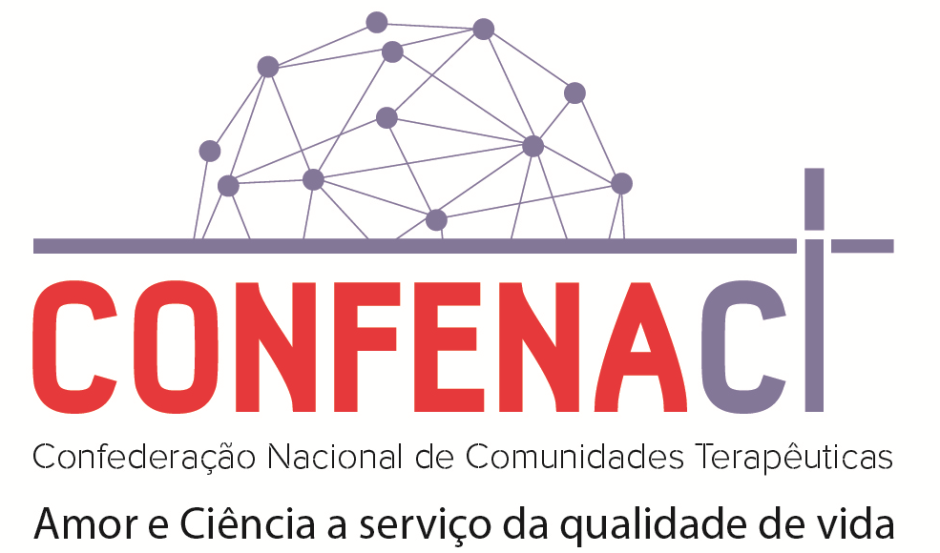
```

\bcenter
Fonte: Sítio da CONFENACT^[Disponível em: http://www.confenact.org.br/]
\ecenter

  
  As descrições e posicionamentos da CONFENACT e de seus associados sempre destcam a conexão entre ciência e religião existente em seus tratamentos. No site da Cruz Azul, uma das afiliadas da instituição, eles destacam como método [...] a fé no Deus Triúno, conforme o testemunho de toda Sagrada Escritura (Bíblia Judaico-Cristã), aliado ao conhecimento técnico, científico e empírico^[http://www.cruzazul.org.br/sobre]. Não há uma preocupação em negar o caráter religioso da obra, mas sim em enfatizar que ele não é a única coisa presente. 

  Em março de 2018 o Marco Regulatório volta a vigorar. Em Audiência Pública a desembargadora Consuelo Yoshida decide por suspender a liminar de suspensão do Marco. Segundo Yoshida as CT’s se configurariam enquanto equipamentos de acolhimento, e não de saúde. “As CTs não se enquadram adequadamente em estabelecimentos de  saúde voltados para a internação de pacientes portadores de transtornos da saúde física e mental, na medida em que elas buscam promover a saúde psicossocial das pessoas acolhidas”. A questão da categoria “apoio” é resolvida pela introdução do termo "acolhida". Tal vitória é grandemente celebrada pela CONFENACT. A postagem no site oficial datada do mesmo mês fornece mais detalhes sobre o acontecimento:
  
\begin{quoting}[rightmargin=0cm,leftmargin=4cm]
\begin{singlespace}
{\footnotesize
Após um longo período de suspensão (desde agosto de 2016) pela Justiça Federal do estado de São Paulo, a Resolução 01/2015 do CONAD que regulamenta as Comunidades Terapêuticas do Brasil (Marco Regulatório – MR), ESTÁ NOVAMENTE VIGENTE. A revogação da suspensão aconteceu na tarde desta terça-feira, em São Paulo, capital, após a AUDIÊNCIA PÚBLICA no Tribunal Regional Federal de SP (TRF3-SP), localizado na Avenida Paulista, 1842, SP/SP. A CONFENACT participou diretamente da defesa do Marco Regulatório, desde a sua edição em 2015, e depois de agosto de 2016 quando injustamente a Justiça Federal decidiu pela suspensão, a partir do pedido do MPF. Atuaram nos debates e discussões os advogados Egon Schlüter, presidente da CONFENACT, Adalberto Calmon Calmon, assessor jurídico da confederação, acompanhados por Pablo Kurlander, secretário da CONFENACT e advogada Eunice Melhado de Lima, da Fazenda da Esperança. E também pela defesa do MR, o MS, MJ, MDSA, que colocaram por parte do Governo Federal a necessidade da regulamentação das CT’s. Estiveram presentes também o CFP, CFSS e CNDH, que através do MPF entraram com a Ação Civil Pública pedindo a revogação do MR e o não financiamento de vagas pelo Governo Federal, que culminou na suspensão do MR em 2016. Após um debate de mais de 05 horas, o TRF3, e em especial, partir de um pedido da AGU/MJ, decidiu por “derrubar” a liminar que suspendia o MR. Ficou também decidido que daqui há três meses deverá ter uma nova audiência no Tribunal Regional, com a presença do Conselho Nacional de Saúde e Conselho Nacional de Direitos Humanos, para discutir alguns pontos do MR, em especial, mecanismos de fiscalização do financiamento público de vagas. Assim, nesses próximos três meses a CONFENACT buscará avançar no diálogo com o CNS e CNDH para discutir alguns pontos do MR, caso necessário eventual mudança \cite{confenact2018}.}

\end{singlespace}
\end{quoting}

  Na notícia acima, a CONFENACT destaca a presença de outros atores que foram anteriormente citados e afirma que a suspensão do Marco é resultado de suas ações e posicionamentos, como foi anteriormente debatido. 

  Ainda em 2018, um mês após a reativação do Marco, acontece um aumento massivo do investimento federal em entidades que tratam da dependência química. 87,3 milhões foram destinados para tais instituições. Corroboraram para esse edital o ministro Gilberto Occhi (Saúde), o secretário executivo Gilson Libório (\acrshort{MJ}), o ministro Alberto Beltrame (\acrshort{MDS}), e o secretário nacional de Políticas sobre Drogas, Humberto Vianna. A matéria publicada pela Agência Brasil sobre destaca que: 

\begin{quoting}[rightmargin=0cm,leftmargin=4cm]
\begin{singlespace}
{\footnotesize
O que nós temos é uma grande procura por esse método de acolhimento. A taxa de ocupação é de quase 100\%, o que fez então nós percebermos a necessidade de ampliar a rede para esse tipo de atenção”, justifica o médico Quirino Júnior, coordenador-geral de Saúde Mental, Álcool e Outras Drogas do Ministério da Saúde. Ele explica que o encaminhamento para este tipo de tratamento, além de voluntário por parte do paciente, vai requerer, obrigatoriamente, autorização médica. Segundo o ministro do Desenvolvimento Social, Alberto Beltrame, o tempo máximo de permanência do paciente não poderá ultrapassar 12 meses. “Em média, o paciente fica internado por quatro meses, mas o limite é até um ano. Os 87 milhões de reais terão capacidade de contratar em torno de 7 mil leitos. Mantendo uma lógica de rotatividade de três usuários por leito, em torno de 20 mil vagas serão oferecidas ao longo de um ano. Nós estamos quase dobrando a capacidade de contratação e a quantidade de pessoas atendidas [em relação a editais anteriores]”, aponta. O edital prevê que as comunidades terapêuticas possam apresentar diferentes metodologias de tratamento, incluindo laborterapia (que é trabalhar na manutenção do local), psicoterapia em grupo ou individual, programa dos 12 passos (criado inicialmente para tratamento do alcoolismo), atividades espirituais, ações pedagógicas e grupo operativo. \cite{agencia2018}.}
\end{singlespace}
\end{quoting}


  Da quantia citada no edital, 40 milhões são do orçamento do Ministério da Saúde; 37 milhões, do Ministério da Justiça; e R$ 10 milhões, do MDS. A CT contemplada receberá 1.172,28 por adulto acolhido; 1.596,44, por adolescente; e 1.528,02, para mães viciadas acompanhadas de bebês em fase lactante.

  A CFP, por outro lado, continua fazendo denúncias sobre irregularidades encontradas em CT’s. Em junho de 2018 foi publicado pelo Conselho, em parceria com o Mecanismo Nacional de Prevenção e Combate à Tortura (\acrshort{MNPCT}) e a Procuradoria Federal dos Direitos do Cidadão do Ministério Público Federal (\acrshort{PFDC}PFDC/MPF), o Relatório da Inspeção Nacional em Comunidades Terapêuticas. No documento é possível perceber que muitas das Comunidades pesquisadas restringem a liberdade religiosa dos internos [@cfp2018,15], assim como há práticas que configuram como indícios de tortura [@cfp2018,14]. Das comunidades pesquisadas 64% recebia financiamento público [@cfp2018,18].

  Em relação a este Relatório, a CONFENACT se pronunciou formalmente em um manifesto lançado no mesmo mês. Neste manifesto a instituição argumenta que o número de CT’s estudadas não era o suficiente para fazer uma generalização. Mais uma vez o argumento da seletividade na escolha das Comunidades avaliadas é utilizado, como é possível ver no trecho abaixo:

\begin{quoting}[rightmargin=0cm,leftmargin=4cm]
\begin{singlespace}
{\footnotesize
Infelizmente o Relatório de Inspeção, dentro de um contexto de mais de 2.000 CTs no Brasil, de forma dirigida, com o objetivo de prejudicar todo um segmento, selecionou 28 entidades em sua maioria involuntárias, com problemas de violação de direitos humanos, entidades com fins lucrativos, para dar característica de uma pesquisa nacional, de uma avaliação do todo do segmento. Evidencia-se esta grande contradição, pelo próprio nome dado ao Relatório de Inspeção (Relatório da Inspeção Nacional em Comunidades Terapêuticas), com uma vistoria pontual em somente 0,08\% das entidades/unidades (CTs), e em somente 12 dos 27 estados do Brasil. Que ainda é reiterada, pelo registro no próprio texto, quando é citado no “Resumo Executivo”: “A sistematização das informações coletadas nos 28 estabelecimentos vistoriados busca, portanto, trazer um retrato do modo de atuação dessas instituições, permitindo um olhar geral, sem que se perca de vista as especificidades de cada local.” (Página 11). Ou seja, lança-se um olhar geral, generalizando-se 28 casos específicos para todo um segmento, sem mencionar informações específicas, números, mas com o uso da expressão vaga “grande parte” das entidades \cite[p. 02]{confenact2018b}.}
\end{singlespace}
\end{quoting}

  Outra alegação da CONFENACT é a de que a CFP e outros movimentos contrários as CT’s não ouvem os próprios psicólogos que atuam nessas instituições, muitas vezes por livre e espontânea vontade, e que esses ataques são de ordem ideológica. 

\begin{quoting}[rightmargin=0cm,leftmargin=4cm]
\begin{singlespace}
{\footnotesize
Destaca-se, visto que o CFP lidera o movimento ideológico contra as comunidades terapêuticas, não considera os profissionais da psicologia que atuam nas entidades, não dando voz a estes, que nas conferências, seminários e fóruns, compartilham que não se sentem representados pelo conselho federal e pelos conselhos estaduais (regionais). Segundo pesquisa do IPEA há em média 1,8 psicólogos por CTs, em sua maioria empregados contratados, considerando a opção do voluntariado, bem como de outros profissionais, como assistentes sociais (1,3 por CT), o que denota a preocupação técnica e profissional no atendimento nas entidades, o que ajuda a afastar eventuais abusos ou condutas relacionados a violação dos direitos humanos. Vemos importante, que o CFP faça uma pesquisa com os profissionais psicólogos que atuam nas CTs, para que possam dar consistência ao levantamento de informações sobre o segmento. Situação muito similar acontece com o CFSS – Conselho Federal de Serviço Social e os estaduais/regionais, que tem uma atitude radical contra as CTs muito similar e até maior, onde a partir de um viés ideológico desrespeitam os valiosos profissionais que atuam nas CTs." \cite[p. 03-04]{confenact2018b}.}
\end{singlespace}
\end{quoting}


Ainda sobre isto acrescenta:

\begin{quoting}[rightmargin=0cm,leftmargin=4cm]
\begin{singlespace}
{\footnotesize
REPUDIAMOS A POSTURA DE DESCONSTRUÇÃO ADOTADA PELOS SIGNATÁRIOS DO RELATÓRIO DE INSPEÇÃO, selecionando entidades que prestam desserviços e também de outras, que atendem dentro dos preceitos legais, mas com desrespeito dos signatários deste infeliz documento para com as atividades terapêuticas desenvolvidas por estas, fazendo julgamentos dentro de um viés ideológico que não admite a existência das Comunidades Terapêuticas, em franco desrespeito à legislação \cite[p. 06]{confenact2018b}.}
\end{singlespace}
\end{quoting}

### (2019 - 2020) O Ápice

  Apesar das crescentes vitórias que o movimento vivenciava é em 2019 que acontece o evento que escreveria de vez o nome das CT’s na história do país. É nesse ano que elas tomam o lugar de destaque e passam a atuar como carro chefe das Políticas Nacionais de Drogas (\acrshort{PNAD}). 

  Um dos primeiros acontecimentos que corroboraram diretamente para isso foi o início do mandato do presidente Jair Bolsonaro (PSL/Sem partido), candidato que desde o início da sua campanha se revelava enquanto político conservador e ávido apoiador de pautas liberais e religiosas (vide seu lema _"Brasil acima de tudo, Deus acima de todos"_) que iam contra as ditas “políticas ideológicas” realizadas pelos governos anteriores. Em seu plano de governo^[disponível neste [link](https://divulgacandcontas.tse.jus.br/candidaturas/oficial/2018/BR/BR/2022802018/280000614517/proposta_1534284632231.pdf)] a questão das drogas é introduzida enquanto parte de uma problemática que não apenas é ligada diretamente à ascensão da esquerda como é alimentada pela mesma, citando como exemplo o chamado "bolsa crack", nome pejorativo do Programa "De Braços Abertos" criado por Fernando Haddad em 2014 enquanto prefeito de São Paulo[@de2019programa]. Esse foco no elemento "ideologia" que é aí empregado é bastante similar ao da CONFENACT e afins ao falar das instituições que lhe contrapunham. 
  
  Ao tomar posse, Bolsonaro decide manter por perto alguns nomes que já lidavam com a questão do uso abusivo de drogas e trabalhavam em prol das CT's no ambiente federal, como por exemplo Osmar Terra que se tornou ministro da Cidadania e Quirino Cordeiro, atual chefe da SENAPRED (Secretaria Nacional de Cuidados e Prevenção às Drogas), mas não apenas isso como também insere novos personagens de respaldo como a advogada e pastora Damares Alves, atual ministra da Mulher, da Família e dos Direitos Humanos e que atua ativamente na luta contra a legalização do aborto, o feminismo e outras pautas progressistas. Esses três personagens são os responsáveis durante os anos iniciais deste governo de direcionarem parte de sua energia para a construção e aprovação de leis e orçamentos que favorecessem as Comunidades, Logo em março é assinado por eles um documento que aumentava significativamente o número de vagas financiadas pelo Governo Federal, que passou de 6.609 para 10.883. No evento Damares falou que: _"Neste ato, Estado laico reconhece a importância das comunidades religiosas. Estamos construindo uma nova nação, isto é o retrato de um novo Brasil”_^[Disponível em https://rb.gy/8ibudi] 
  
```{r imagem11, echo = FALSE, fig.cap = "Damares Alves assinando documento que prevê aumento de vagas.", fig.pos = "H",fig.align='center', out.width="80%" }

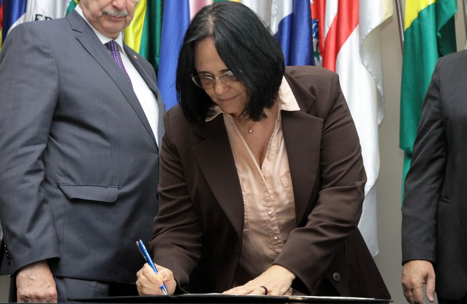
```

\bcenter
Fonte: Sítio do Governo Federal^[Disponível em https://rb.gy/8ibudi] 
\ecenter
  
```{r imagem12, echo = FALSE, fig.cap = "Osmar Terra assinando documento que prevê aumento de vagas, Quirino ao fundo.", fig.pos = "H",fig.align='center', out.width="80%" }

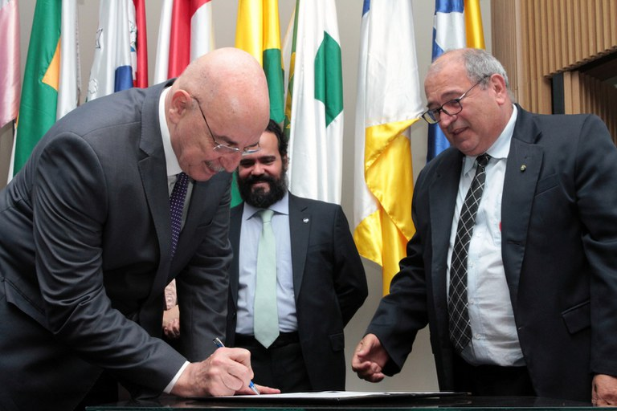
```

\bcenter
Fonte: Sítio do Governo Federal^[Disponível em https://rb.gy/8ibudi] 
\ecenter
  
  
  Ainda no começo deste novo governo, a _Frente Parlamentar Mista em Defesa das Comunidades Terapêuticas e Apac's_ é novamente ativada por Eros Biodini (PROS-MG). Assim como em 2015, o retorno da Frente, dessa vez com a ação conjunta dos ministros, é indicativo de mudanças nos rumos das Comunidades. O que de fato aconteceu em Junho a partir da alteração da Lei n. 11.343/2006, agora intitulada Lei 13.840, de 5 de junho de 2019. Das 14 mudanças operadas no documento três chamam a atenção. A primeira é não mencionar em nenhum ponto do documento o termo "Redução de Danos", o que aponta que este não é mais o norte das novas políticas públicas para uso abusivo de drogas. Pelo contrário, o texto salienta que os acolhimentos devem ser feitos em unidades “que visam à abstinência”, em outras palavras, CT’s. 

  O segundo ponto a ser destacado é a facilitação do processo de financiamento, dado que elas agora são o modelo que o país optou por empregar. Isso é perceptível, por exemplo, no documento mencionado nos parágrafos anteriores que ampliava o número de vagas financiadas, sendo destinado a isso o montante de R$ 150 milhões^[Disponível em: https://rb.gy/wl747u]. Esse não somente é o maior montante fornecido a elas até então como também é próximo ao valor que o governo investia nos próprios CAPS. 

  O último ponto a ser destacado é a possibilidade de internações involuntárias que podem ser feitas “(...) A pedido de familiar ou do responsável legal ou, na absoluta falta deste, de servidor público da área de saúde, da assistência social ou dos órgãos públicos integrantes do SISNAD, com exceção de servidores da área de segurança pública, que constate a existência de motivos que justifiquem a medida.” [@brasil_lei_2019-1]. 

  O presidente comentou a instauração da lei em suas redes sociais dando ênfase a este terceiro ponto. No _post_ ele alega que “o dependente não é livre, é um escravo da droga” o que, aparentemente, seria o suficiente para autorizar internações contra a sua vontade. Vale lembrar ainda que as próprias CT’s são consideradas órgãos públicos que integram a SISNAD logo passíveis, em última instância, de autorizar internações desse tipo.


```{r imagem13, echo = FALSE, fig.cap = "Tweet da Conta Oficial do Presidente falando sobre a nova lei.", fig.pos = "H",fig.align='center', out.width="80%" }

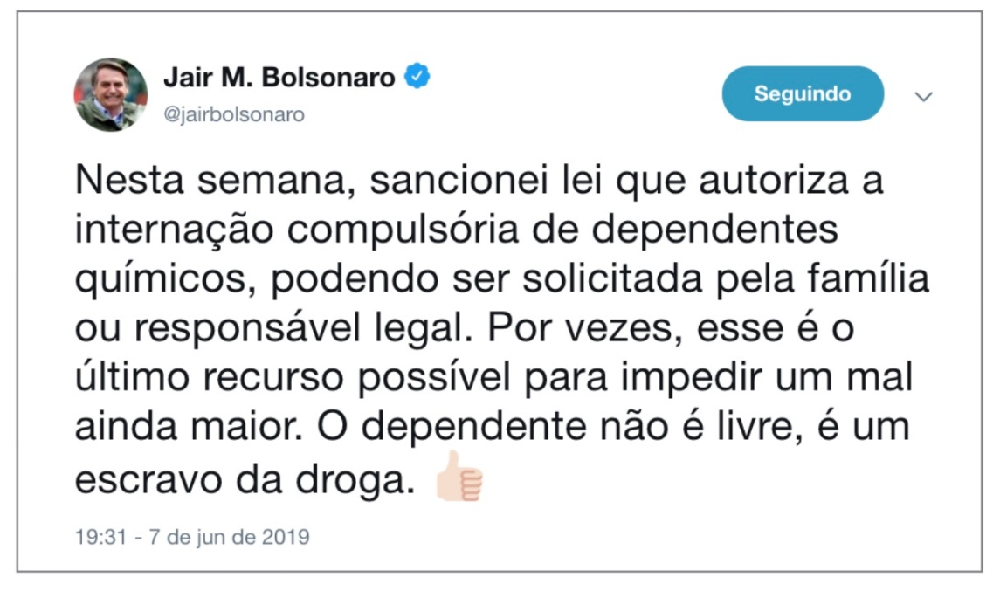
```

\bcenter
Fonte: Twitter^[Disponível em: https://twitter.com/jairbolsonaro/status/1137125025226612736]
\ecenter

  Para os defensores da causa das CT’s as alterações foram mais que bem vindas. A antiga lei, na visão deles, não era apenas ineficaz como também maléfica. Em artigo escrito por Quirino Cordeiro para o Observatório Brasileiros de Informações sobre Droga (\acrshort{OBID}) são elencadas várias “desassistências” que teriam feito o governo optar por este novo modelo, dentre elas se destacam o desvio e mal uso da verba pública, o que gerou grandes prejuízos, subnotificações de atendimento, ausência de equipes para atuação no \acrshort{CAPS}, o fechamento irresponsável de hospitais psiquiátricos e manutenção de “cursos com baixo conteúdo técnico e alto teor de doutrinação político-ideológica”. Ainda segundo ele existia uma marginalização das CT’s gerada pela política Antimanicomial e a Redução de Danos, como é possível ler no seguinte trecho^[Disponível em: https://rb.gy/ez2uud]:

\begin{quoting}[rightmargin=0cm,leftmargin=4cm]
\begin{singlespace}
{\footnotesize
As Comunidades Terapêuticas eram negligenciadas e marginalizadas pelo Ministério da Saúde. Em decorrência dos graves problemas relatados acima, os péssimos Indicadores de Resultados da antiga Política Nacional de Saúde Mental eram patentes: crescimento das taxas de suicídio nos últimos 15 anos; aumento de indivíduos com transtornos mentais graves em situação de rua; encarceramento de pacientes com transtornos mentais graves; aumento da mortalidade de tais pacientes; superlotação de Serviços de Emergência com pacientes aguardando vaga para internação; aumento do uso de drogas e dependência química no país; crescimento e expansão das Cracolândias; aumento de pacientes afastados pela Previdência Social, principalmente por depressão e dependência ao crack.}
\end{singlespace}
\end{quoting}

  A discordância de Quirino com as políticas aplicadas no governo anterior é visível ainda em trechos de palestras por ele presididas sobre a Nova lei. Em evento promovido em Novembro pela Federação de Comunidades Terapêuticas Evangélicas do Brasil, ele afirma que:

\begin{quoting}[rightmargin=0cm,leftmargin=4cm]
\begin{singlespace}
{\footnotesize
A luta antimanicomial trouxe conceitos completamente equivocados na organização de ofertas cuidados das pessoas com transtornos mentais e dependência química no Brasil. A luta vinha proclamando a necessidade de fechamento de serviços, por exemplo, de internação em hospitais psiquiátricos, comunidades terapêuticas e fechamento de ambulatórios de saúde mental no País. Isso levou a uma grande desassistência \cite{folha2019}.}
\end{singlespace}
\end{quoting}

  Tal aversão também costuma aparecer nas falas de outras pessoas envolvidas com as CT’s, como por exemplo Pablo Kurlander, atual gestor geral da Federação Brasileira de Comunidades Terapêuticas (FEBRACT). Em palestra sobre a atuação das Comunidades no Brasil feita no III Seminário Nordeste do Programa AMOR-EXIGENTE ele comenta:

\begin{quoting}[rightmargin=0cm,leftmargin=4cm]
\begin{singlespace}
{\footnotesize
O grupo que defende a Luta Antimanicomial diz que o problema da rede no Brasil é que o dinheiro é desviado para as Comunidades Terapêuticas. Porém, o governo começou a financiar as CTs de forma bem modesta apenas em 2013, 26 anos depois da Reforma Psiquiátrica. Em 1990, 3 anos depois, começou uma redução de leitos em hospitais psiquiátricos numa cruzada puramente política e sem ter para onde encaminhar os pacientes. Nesta época, o trabalho das CTs ainda era muito tímido. O Padre Haroldo há apenas 9 anos tinha iniciado o trabalho da APOT e alguns serviços religiosos tinham surgido há uma década em Goiás e no Paraná. Neste momento, então, começa a se desvirtuar o conceito de tratamento das Comunidades Terapêuticas no Brasil. Todas as distorções que vieram em seguida e que são criticadas duramente foram criadas justamente pela má intervenção deste grupo. Temos, então, uma divisão em dois segmentos: os grupos religiosos que começam a atender as pessoas carentes que deveriam ir para os hospitais e o movimento de internação involuntária que funciona, na maioria das vezes, de forma ilegal e irregular para aqueles que podem pagar pela internação. No meio desse caos e na tentativa de resgatar aquilo que as CTs de fato eram, em 1990 Padre Haroldo Rahm funda a FEBRACT \cite{febract2019}} 
\end{singlespace}
\end{quoting}


  Para além de mencionar novamente o elemento "ideologia", comum no discurso institucional desde 2018, Kurlander também traz à tona outro ponto que CONFENACT também defendia em seus posicionamentos contra a \acrshort{CFP}: A _“Real Comunidade Terapêutica”_. Dessa forma, ele coloca assistencialismo religioso e internação involuntária ilegal como elementos que pertencem a uma entidade outra que não as reais Comunidades, criando assim uma narrativa institucional própria e limpa, totalmente desvinculada desses inconvenientes do passado^[Também conhecida como _Falácia do Verdadeiro Escocês_, esse tipo de técnica argumentativa separa e deslegitima ações que prejudiquem o ponto de vista do interlocutor, sendo seu uso extremamente comum no que diz respeito a questões que envolvem pautas religiosas. É possível encontrar suas aplicações em várias situações, tais como "Homens bomba não fazem parte do 'Verdedeiro Islã'" [@orsi_is_2003,171] ou  "O Nazismo não tem relação com o 'Verdadeiro Cristianismo'" [@avalos_fighting_2005, 258]]. 

  A adoção dessa narrativa também marca uma reviravolta na forma como as CT's se defendem. Se elas antes assumiam quase que um papel passivo, alegando apenas o uso de má fé nas acusações, agora eles tomam um passo à frente e somam a essas alegações anteriores um suposto “ataque ideológico” a suas ações, que eram direcionadas em primeiro lugar em uma tentativa de cobrir um “vácuo de desassistência” gerado por esta mesma ideologia que lhe tenta condenar. Não existe nessa lógica provas factuais do ataque ou do viés ideológico, o mais próximo disso foi uma contestação feita pela \acrshort{FEBRACT} em uma das notas de esclarecimento^[Disponível em: febract.org.br/portal/wp-content/uploads/2020/06/PRONUNCIAMENTO-FEBRACT-SOBRE-RELATORIO-NACIONAL-DE-CTS-CFP-MPF-MPCT.pdf] sobre problemas de amostragem e viés feitos pelo CFP invalidarem as afirmações por ele feitas. Uma parte do que foi ali argumentado viria a compor um capítulo da tese do próprio Kurlander [@perrone_fatores_2019,41-43] que, curiosamente, empregou erros similares aos que alega existir na pesquisa do CFP como, por exemplo, estabelecer amostra por conveniência e não oferecer testes confirmatórios das análises por ele feitas.^[É problemático que uma pesquisa faça uso de Análise de Regressão e não disponha, no mínimo, o $R^2$ ajustado, para futuras verificações de adequação dos dados a linha.]

  A CFP, por outro lado, ao se posicionar sobre a lei destaca o quão problemático soa a internação involuntária e como o processo de declaração por escrito, estabelecido tanto para internações voluntária quanto pedido de desligamento, é discriminador, dado que não leva em consideração analfabetos (que em sua maioria estão nas camadas sociais mais baixas) e pessoas com distúrbios ou deficiências que dificultam o ato^[Disponível em: www.encurtador.com.br/inv37 ]. Ainda são acrescentadas as críticas à forma como a lei foi criada sem debate com outras as entidades envolvidas no campo. Como é possível ler nos trechos abaixo:

\begin{quoting}[rightmargin=0cm,leftmargin=4cm]
\begin{singlespace}
{\footnotesize
O texto da lei deveria definir que esta declaração poderia ser por escrito ou feita pela forma e pelo meio de comunicação que seja mais acessível, expressando de maneira inequívoca o desejo da pessoa”, afirma Biancha Angelucci, pesquisadora consultada. “Tal imprecisão da lei favoreceria discriminações sobre populações já vulnerabilizadas, em situação de rua, por exemplo”. Segundo o presidente do Conselho Federal de Psicologia (CFP), Rogério Giannini, \textbf{as mudanças foram feitas sem o devido processo de discussão, sem passar pelos Conselhos de Saúde e Conferências.} “A profundidade destas mudanças devem passar pelo controle social, pois atingem diretamente as pessoas que são o interesse dessas políticas”, avaliou. Em nota pública conjunta assinada pelo CFP e outras entidades por meio da Plataforma Brasileira de Política de Drogas, em 6 de maio de 2019, os coletivos chamam a atenção para “a previsão da internação involuntária pelo prazo de até 3 meses, sem o devido cuidado para que esse dispositivo não seja utilizado para o recolhimento em massa da população em situação de rua como forma de higienização das grandes cidades. Ademais, diferentemente do previsto na Lei da Reforma Psiquiátrica, também não atribui à família ou ao responsável legal o poder de determinar o fim da internação involuntária \cite[grifo meu]{cfp2019}.}
\end{singlespace}
\end{quoting}


  O ano de 2020, não muito diferente do anterior, consolidou os avanços das CT's enquanto política. Um dos primeiros acontecimentos que marcam este período é a verba de 300 milhões, praticamente o dobro do ano anterior, que foi destinada a estas instituições, tornando esse o ano com o maior montante de investimento federal. Na postagem oficial no site do Governo encontra-se a seguinte declaração de Eduardo Cabral, membro do SENAPRED: "Hoje, o governo reconhece essa ação como um trabalho de excelência restaurando vidas. Hoje, são mais de 11 mil pessoas recuperadas, sabemos que temos entre 3 e 4 milhões de usuários de drogas. Quanto mais a gente conseguir mostrar às famílias que estão em desespero que existe solução para a dependência química, menos Cracolândia nós teremos."^[Disponível em: https://rb.gy/yutiyq]  
  
  
```{r echo=FALSE}

ano <- c("2017", "2018", "2019", "2020")
n <- c(48, 87,153,300)

mont <- data.frame(ano,n)
library (tidyverse)
#montante das CT's
g5<- ggplot (mont, 
        aes(x = ano, y = n, group = 1)) +
  geom_line (size = 0.8, colour = uma) +
  geom_point(size = 2, colour = uma) +
labs (x = "Anos",
      y = "Valor (em milhões)") +
  theme_minimal()

```
  
  
```{r g5, echo = FALSE, fig.cap = "Verba Federal (em milhões) destinada as Comunidades Terapêuticas entre 2017 e 2020.", echo=FALSE, out.width= "100%", fig.pos = "H"}

plot (g5)

```

\bcenter
Fonte: Editais de Licitação
\ecenter
  
  A menção as Cracolândias e o seu fim nessa fala não é algo em vão. O ano de 2020 também é marcado pela aplicação de uma série de políticas que, somadas a nova lei, aumentam ainda mais o escopo de ação das CT's. em Julho a CONAD estabelece em resolução, com prazo de início para 2021, a internação de adolescentes a partir de 12 anos. Em outubro a ministra Damares Alves criou 1,4 mil vagas vagas específicas em CT's para usuários abusivos de droga em situação de rua sendo destinado para isso o total de de R$ 10,2 mi, valor este que foi dispersado entre 287 instituições espalhadas por todo o país. No discurso de abertura do evento, a ministra enfatizou que: 
  
\begin{quoting}[rightmargin=0cm,leftmargin=4cm]
\begin{singlespace}
{\footnotesize
Mais uma vez estamos trazendo para a pauta e dando visibilidade às comunidades terapêuticas. Isso é um sonho. A maior obra do governo Bolsonaro é essa: investir em vidas e pessoas. Vamos mudar desse jeito, juntos, pois a gente acredita na Comunidade Terapêutica no Brasil \cite{gov2020}.}
\end{singlespace}
\end{quoting}


Que foi complementado pela seguinte fala de Quirino:


\begin{quoting}[rightmargin=0cm,leftmargin=4cm]
\begin{singlespace}
{\footnotesize
Damos mais um passo para fortalecermos as Comunidades Terapêuticas, o cuidado efetivo com as pessoas com dependência química no Brasil e a proteção dos mais vulneráveis, em situação da rua \cite{gov2020}.}
\end{singlespace}
\end{quoting}

  Esse evento, assim como os anteriormente citados, servem como ilustrativo da ação destes dois atores no que diz respeito ao aumento do reconhecimento e poder das CT's. Um sonho, nas palavras de Damares, que se torna cada vez mais realidade. Aos poucos todas as barreiras colocadas no processo de escalada destas instituições foram destruidas e em seu lugar foram postas enormes vantagens como as descritas nos parágrafos anteriores. 
  
  Ainda em 2020 aconteceram as eleições municipais e, cientes do poder que essas instituições ganham no atual cenário e da nova lei, alguns dos políticos que concorreram a cargos nas eleições municipais deste ano mencionaram elas como parte de sua política. É o caso de Joice Hasselman, candidata a prefeitura de São Paulo pelo PSL, que defendeu a construção de "Cristolândias", alegando que iria "[...] trazer as igrejas para dentro da Prefeitura de São Paulo"^[Disponível em: https://rb.gy/jsx9sz].
   
  Apesar de todas estas conquistas que o Governo Bolsonaro trouxe, é em Dezembro de 2020 que é dado o passo para o que pode vir a ser o movimento final do Governo na disputa entre os modelos de atenção. Nesse período é cogitada a criação de projeto de revogação das portaria de saúde mental, o que representaria a modificação extrema ou o fim de programas criados entre 1991 a 2014, como "De volta para Casa", para reinserção de indivíduos que se submetem a longas internações psiquiátricas, e os CAPS, com foco especial nos CAPS AD ^[Disponível em: https://bit.ly/3gd1RiR] que são criados especificamente para pessoas que enfrentam o uso abusivo de drogas. 
  
  Apesar de ainda não ter havido pronunciamento oficial sobre o ato é possível entender, no contexto em que ele foi promulgado, suas reais intenções. O fim desses programas é a chave para que a disputa se encerre e as CT's consigam, de todas as formas, serem as protagonistas do cuidado de usuários abusivos de drogas, representando a vitória da abstinência sobre a redução de danos. Vários personagens e instituições se posicionaram contra as revogações. Senadores destacaram que tal ato representa uma parte do desmonte do SUS, e destacam que "Estamos passando por uma das piores crises que nosso país já viveu. Tem desemprego, caos na saúde, desigualdade social. Desmontar a política de saúde mental é entregar nosso povo ao adoecimento. Não vamos permitir!”^[Disponível em: https://bit.ly/37TpOal]. Erika Koyak, líder da Frente Parlamentar Mista em Defesa da Reforma Psiquiátrica e da Luta Antimanicomial elucida^[Disponível em: https://rb.gy/hwdaci] que atráves de tais ações:
  

\begin{quoting}[rightmargin=0cm,leftmargin=4cm]
\begin{singlespace}
{\footnotesize
o governo açoita a Constituição, usurpa o papel do Congresso e desconstrói a legislação brasileira, além de trazer de volta o holocausto dos hospícios e manicômios. O Ministério da Saúde agora financia choques elétricos e leitos psiquiátricos, hospício cronifica a doença e priva o paciente do convívio com as pessoas. A liberdade é terapêutica}
\end{singlespace}
\end{quoting}


### Conclusão: Religião e Políticas Públicas no Brasil

  A análise investigativa da trajetória das CT’s no Brasil desponta uma série de questionamentos: Por que um modelo que se apoia, seja parcialmente ou completamente, em religiosidade é tão valorizado e apoiado pelo Governo brasileiro? Mesmo que ela apareça com outras roupagens como a espiritualidade, o amor, ou a simples educação moral é inegável a presença da religião nesse meio. As CT’s em sua maioria são criadas ou mantidas por instituições religiosas, como foi exposto na seção anterior. Dentro de uma lógica de “Estado Laico” como se sustenta essa clara contradição?

  A resposta para isso se encontra, em parte, na própria linha do tempo aqui desenhada. Em 2011 não acontecia apenas a aproximação das CT’s com o governo federal, mas também o fortalecimento da bancada evangélica. A eleição de 2010 foi única não somente por debater o problema do crack, mas também por ser uma das primeiras que fatores religiosos começaram a ter um peso bem maior do que tinham em outras edições [@pierucci_eleicao_2011; @machado_religiao_2012]. O número de candidatos religiosos, que apesar de crescerem exponencialmente desde a redemocratização tiveram uma queda de representatividade em 2006, volta a aumentar neste ano. Em especial pela presença dos evangélicos, que passam a conquistar mais espaço. O gráfico abaixo permite acompanhar esse crescimento.


```{r, echo = FALSE, warning = FALSE}

freq <- c(44, 68, 32, 63, 75, 84)
anos <- c("1998", "2002", "2006", "2010", "2014", "2018")

eva.cam <- data.frame(anos,freq)


#gráfico membros bancada BBB
g6<- ggplot (eva.cam, 
        aes(x = anos, y = freq, group = 1)) +
  geom_line (size = 0.8, colour = uma) +
  geom_point(size = 2, colour = uma) +
labs (x = "Anos",
      y = "Frequência") +
  theme_minimal()


```


```{r g6, echo = FALSE, fig.cap = "Representação Evangélica na Câmara Federal.", echo=FALSE, out.width= "100%", fig.pos = "H"}

plot (g6)

```

\bcenter
Fonte: Agência Brasil; DIAP, 2018
\ecenter

  O crescimento quase ascendente dos protestantes na política que acontece no período pós-redemocratização é reflexo tanto de um desejo de proteção, dada a perseguição que eles sofreram durante a ditadura militar, quanto uma resposta direta ao pluralismo instituído pela secularização^[Por mais que haja uma discussão sobre a diferença entre laicidade e secularização, os termos serão aqui usados como sinônimos, dado que a discussão aqui feita reflete um aspecto que ambos os conceitos retratam de igual forma, a separação entre Estado/Igreja [@mariano_laicidade_2011-1,246].] .

  Em relação ao primeiro motivo é importante frisar que nem sempre o comportamento dos evangélicos foi tão político quanto é hoje. Por um longo período eles se mantiveram longe desse meio, sendo o “apolitismo” uma de suas marcas registradas [@mariano_laicidade_2011-1,250; @campos_os_2006,02]. Entretanto, em 1986, junto com o movimento de redemocratização, o “crente não se mete em política” se torna o “irmão [que] vota em irmão” [@mariano_laicidade_2011-1,251]. Tal transformação foi impelida, principalmente, pelo medo do retorno da perseguição sofrida durante a Ditadura Militar pelo chamado Departamento de Defesa da Fé e pela perda de privilégios junto ao Estado. [@mariano_laicidade_2011-1,251]. Desse período em diante o número de pentecostais no poder aumentou consideravelmente, através de investimento em comunicação via rádio/TV e do trabalho de base dos próprios pastores [@freston_pentecostalism_1995-1,129]

  No que diz respeito ao segundo motivo é perceptível que a religião não é apenas parte da vida privada. Ela também tem poder nos espaços públicos, em especial na política, espaço no qual a secularidade deveria se sobrepor. Um dos primeiros problemas na lógica empregada no debate dos espaços da religião é a de tratar o “privado” como uma categoria não problemática, gerada exclusivamente pelo contraste com as outras esferas da vida social e a ação direta da racionalidade, burocratização e racionalização [@mariano_expansao_2016,716]. Com dito anteriormente isso cai por terra quando se observa a atuação religiosa no âmbito público. 
  
  Casanova [-@casanova_public_1994-1] e Smith [-@smith_disruptive_1996; @smith_american_1998] são alguns dos autores que demonstram isso através do estudo da atuação dos grupos religiosos na política. Analisando casos de vários países, incluindo o Brasil, Casanova [-@casanova_public_1994-1] conclui que a separação das esferas, apesar de real, não influenciou em nada a construção e atuação de lobbys religiosos. Smith chega a conclusões similares tanto avaliando o próprio movimento evangélico [@smith_american_1998] quanto em outros cenários como, por exemplo, o ativismo social. Ele identifica movimentos nos quais a participação religiosa foi a chave para o sucesso dos mesmos como, por exemplo, a Revolução da Nicarágua em 1979 e o Anti Apartheid [@smith_disruptive_1996,02]. O que se percebe, enfim, é que não apenas a religião não é um fenômeno fadado ao desaparecimento ou ao confinamento do espaço privado, mas que esse próprio tipo de lógica é o que as impulsiona a se sobressaírem e lutarem pela sua sobrevivência. Não apenas isso como também estimula os próprios indivíduos a buscarem nela esse espaço utópico de finalidade e salvação que a modernidade falha em entregar [@miranda_religiao_1995,16]. A existência de um filtro entre as esferas, enfim, não é sinônimo de aplicação do mesmo [@butler_political_2011,25]

  Tendo tudo isto em mente fica mais fácil entender o motivo pelo qual essa política conseguiu tanta adesão e legitimidade. Em pleno espírito de guerra, os religiosos adentram no círculo político e formam seus lobbies que atuam tanto em defesa própria como de seus ideais, instaurando um combate a pautas que os contradigam tais como descriminalização do aborto, ideologia de gênero, casamento entre pessoas do mesmo sexo, eutanásia etc. [@mariano_laicidade_2011-1; @natividade_sexualidades_2009]. 
 
  Neste conjunto de pautas defendidas também se encaixam as Comunidades Terapêuticas. Tal modelo se mostra mais positivo aos protestantes, pois confronta uma política até então em vigor que era baseada apenas em ciência (Redução de Danos) e que não tinha espaço para Deus ou espiritualidade em seu escopo. Não apenas o fundador da Frente Parlamentar é filiado a Bancada Evangélica como grande parte dos membros desta também o são. O gráfico abaixo demonstra este quantitativo em 2015, ano da aprovação da RDC, e 2019, ano da aprovação da Lei 13.840:


```{r, echo=FALSE}

memb <- c("Bancada Evangélica", "Bancada Evangélica", "Outros", "Outros")
freq <- c(80, 118, 92, 89)
ano <- c("2015", "2019", "2015", "2019")
apct <- data.frame(freq, ano, memb)


#grafico crentes da FPCT

g7 <- ggplot(apct,
             aes(x = ano, y = freq, fill = memb)) +
  geom_col(position = "dodge") +
  labs ( x = "Ano",
         y = "Frequência",
         fill = "Membros"
  ) +
  theme_classic() +
  scale_fill_manual(values = duas)

```

```{r g7, fig.cap = "Distribuição dos Membros da Bancada Evangélica que faziam parte da Frente Parlamentar das Comunidades Terapêuticas e das APAC'S", echo=FALSE, fig.pos = "H", out.width= "100%"}

plot (g7)
```

\bcenter
Fonte: Câmara dos Deputados
\ecenter

  Apesar de em 2015 o número de integrantes pertencentes a Bancada Evangélica ser relativamente baixo (40%) ele cresce bastante em 2019, ao mesmo tempo que diminui, em relação ao ano anterior, a participação de membros de outras bancas. O que se percebe com isso é que elas são, de fato, uma das políticas que eles procuram, enquanto lobby, defender.
