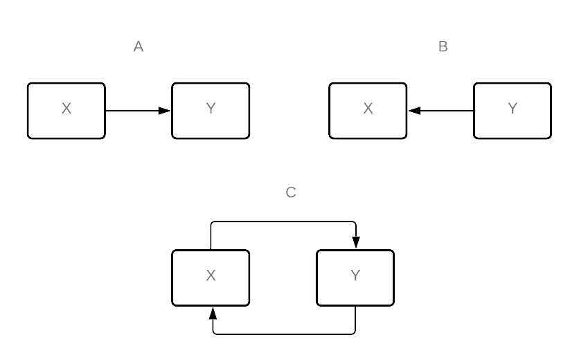
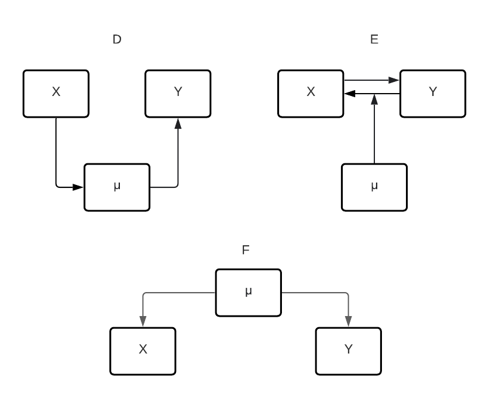
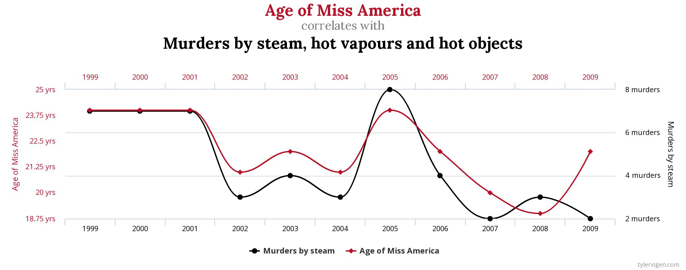
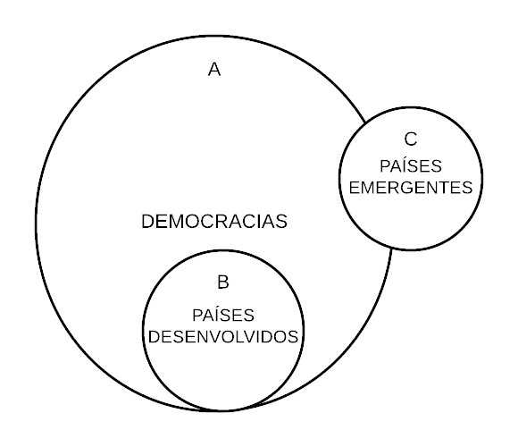
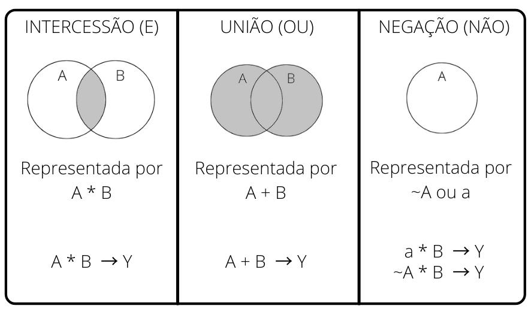
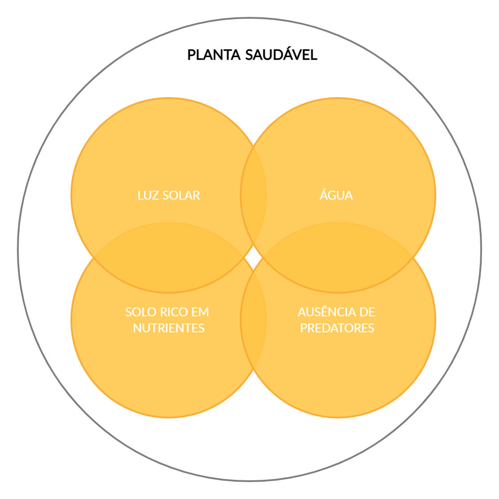

# Metodologia

  Após uma explanação sobre do que esse estudo trata, dos desafios que essa temática impõe e das hipóteses criadas com base na teoria existente sobre o assunto, o próximo passo é detalhar quais meios serão utilizados para atingir os desideratos aqui propostos. Nas próximas seções irei falar sobre as soluções que foram aqui empregadas. Primeiramente discorrerei sobre o questionário, em especial sobre como ele foi arquitetado, o que cada seção pretendia capturar, como as perguntas foram projetadas e outros elementos como randomização e diminuição de vieses. Após, irei falar sobre a metodologia utilizada tanto para a construção do estudo quanto para a análise dos dados coletadas, no caso a _Qualitative Comparative Analysis_ (QCA). 
  
  Ainda dentro da segunda seção tratarei de explicar os mecanismos teóricos e matemáticos que dão suporte a esta metodologia, em especial Teoria dos Conjuntos e Lógica Booleana. Tal medida é essencial para que o leitor entenda como a metodologia se opera e como os resultados são obtidos e interpretados. Ressalto ainda que a QCA é totalmente diferente de outras abordagens estatísticas até então utilizadas pela Sociologia, dado que não tem precedentes como Normalidade e Aleatoriedade [@schneider_set-theoretic_2012,04] o que torna importante a leitura desta seção. O uso de notação matemática é inevitável, mas será feito da forma mais acessível possível. Para além dos mecanismos internos também serão abordadas questões como a Causalidade Conjuntural, dado que se entende debater sobre efeitos, e relações de Necessidade e Suficiência entre as condições.


## O Questionário

### Construção do Questionário

  Como dito anteriormente são escassos os estudos quantitativos nas duas grandes temáticas deste estudo: Conversão Religiosa e Comunidades Terapêuticas. A grande maioria se baseia em Entrevistas em Profundidade e Etnografias/Observação Participante, o que acabou concedendo a essas técnicas uma espécie de "cânone metodológico". Logo, um dos primeiros desafios foi a criação de um instrumental que conseguisse capturar, de forma acurada, todos esses elementos que pertencem ao campo da subjetividade e digam respeito as hipóteses que aqui se levantam. Para isso o apoio nos trabalhos qualitativos já existentes foi fundamental, dado que foram a base para a construção de construtos mensuráveis do conceito. 
  
  O questionário foi dividido em 6 seções: _Dados Socioeconômicos_, _Religião_, _Histórico de Dependência Química e Passagens por Comunidades Terapêuticas_, _Pós Comunidade Terapêutica_, _Escalas de Atitude_ e _Fatores Sociais_. Cada uma dessas seções procura extrair, em ordem, informações específicas sobre o respondente, sua relação com a igreja/fé, suas passagens por CT’s, sua relação passada e atual com o uso abusivo de drogas e suas redes sociais. Nos próximos parágrafos serão explanadas cada uma dessas seções, dando foco ao que cada uma delas tenta medir e de que forma o pretendem fazer.

#### Dados Socioeconômicos

  Constituída de 8 perguntas, sendo uma delas feita em duas partes _(double step)_, esta seção se destina a capturar as seguintes informações básicas do respondente: Idade, Sexo, Profissão, Número de filhos e se tem contato com eles, Escolaridade, Estado Civil, Estado no qual reside, e a idade que começou a trabalhar. Como não existiu uma etapa qualitativa utilizou-se essa seção para criar um "perfil geral" da pessoa que respondeu o questionário.
  

#### Religião

  A seção de religião é constituída de 9 questões. É a partir dela que o questionário começa a se especificar segundo lógica própria logo apenas 6 eram visíveis para todos os respondentes. Caso o respondente não estivesse frequentando nenhuma igreja ele não veria a questão perguntando qual seria, se não fosse protestante não veria a que pedia pela especificação da denominação que ele fazia parte e se não fosse convertido não seria perguntado aonde este processo deu início. No geral esta seção tentou avaliar frequência com que vai à missas/cultos/reuniões, nível de cometimento com atividades religiosas, nível de crença em elementos religiosos e, por fim, uma escala de religiosidade na qual o próprio respondente foi convidado a considerar, de 1 a 10, o quão religioso era.
  
  Outro destaque desta seção é a pergunta sobre Conversão, uma das que iram configurar como parte do que aqui pretendo testar. Como ressaltei na discussão do capítulo anterior ela possui propriedades bastante específicas sendo uma delas o seu caráter processual e discursivo, logo não se pode limitar o questionamento a um simples "sou" ou "não sou", mas também aceitar um estado de potência, um "serei". Com base nisso optei por usar 4 opções: _"Sim, sou convertido"_, _"Não, não sou convertido"_, _"Estou em processo de conversão"_ e _"Não existe algo como conversão na minha religião"_. 
  

#### Histórico de Dependência Química e Passagens por Comunidades Terapêuticas

  Esta parte do questionário com 14 perguntas (sendo específicas uma pergunta sobre o credo da CT, caso fosse religiosa, e outra sobre quanto tempo passou na instituição caso não tivesse concluído o tratamento), se destinava a checar questões específicas referentes ao uso abusivo de drogas e vivências em Comunidades Terapêuticas. Assim como a primeira, esta seção serviu mais como delineador do respondente do que dado para teste de hipótese. Por meio dela se pode saber mais sobre as condições nas quais o respondente foi acolhido, relação com a família, escala auto pontuada de vício, quais drogas fazia uso, características do modelo terapêutica empregado pela CT e quais funções exerceu durante a passagem.   
  

#### Pós Comunidade Terapêutica

  A antepenúltima seção do questionário é uma das mais importantes, dado que mensura o estado de abstinência. Composta de 6 perguntas, sendo uma delas específica para pessoas em abstinência e uma para pessoas que entraram em relapso, essa parte tenta avaliar como o respondente se encontra atualmente e suas opiniões sobre o processo terapêutico, em especial se acha que outros tratamentos seriam tão eficazes quanto, a opinião sobre tratamentos à base de redução de danos e recuperação e reinserção social.
  

#### Escalas de Atitude

  Essa seção, como o próprio nome já diz, tenta avaliar como o respondente reage a uma série de afirmações que dizem respeito ao tratamento em si, a recaída e a importância da religião no processo de se manter limpo. Ao todo são 11 itens em Escala Likert de 5 níveis indo de "Concordo Totalmente" para "Discordo Totalmente"

#### Fatores Sociais

  A última seção do questionário, com 6 perguntas, tenta acessar a rede de apoio do respondente. Perguntou-se quais pessoas ou grupos de pessoas forneceram apoio, se ainda havia contato com quem conheceu durante o período de uso abusivo e pessoas que estavam na mesma Comunidade, a importância que a pessoa atribui a si mesma no processo de se manter limpo, a atual relação com a família e uma escala auto pontuada de recuperação 


### Aplicação do Questionário

  O próximo passo após a criação do questionário foi obter a aprovação do Comitê de Ética para a aplicação, dado que alguns dos temas que se pretendiam sondar são considerados sensíveis. Mesmo que perguntas mais densas fossem evitadas, algumas sobre relação familiar e quais drogas eram consumidas podiam potencialmente servir como gatilho para memórias ruins, sentimentos de constrangimento e ansiedade etc. A pesquisa foi aprovada sem muitas modificações com o CAAE de número 42194620.9.0000.5149.
  
  Após aprovação o questionário foi hospedado na plataforma _SurveyMonkey_ e pode-se iniciar a coleta que foi dos dias 10 à 24 de Maio. A divulgação do link de acesso do questionário foi feita em páginas do Facebook direcionadas a CT's e Egressos, Grupos de WhatsApp de Clínicas de Recuperação e outras Redes Sociais. Foi-se utilizada a arte abaixo junto com um texto que introduzia rapidamente a pesquisa, o que era necessário para respondê-la, possíveis riscos e agradecimentos por considerar participar. 
  
  
```{r imagem14, echo = FALSE, fig.cap = "Imagem oficial de divulgação da pesquisa.", fig.pos = "H", fig.align='center', out.width="80%" }


```

\bcenter
Fonte: Do autor, 2021
\ecenter


  Outros cuidados adicionais durante a coleta foram a proibição do site de coletar o IP do respondente, o que garantiria o anonimato, e resposta múltipla, o que limitou a um questionário por aparelho. 
  
 Em ordem de minimizar o viés de ordem as perguntas foram aleatorizadas dentro dos blocos. Ou seja, a ordem no qual as perguntas apareciam era diferente para cada respondente. Ao final da pesquisa o participante era convidado a, caso quisesse, assistir um vídeo para minimizar os efeitos de qualquer gatilho gerado pelo questionário.
  

## Causalidade nas Ciências Sociais
  
  Até o presente momento foram debatidos quase todos os tópicos que são mencionados no título desta dissertação: Uso Abusivo de Drogas, Conversão Religiosa e Políticas Públicas. Todos eles são pertinentes à discussão que aqui se pretende realizar. Resta, entretanto, falar sobre um último assunto que também terá importância nesta pesquisa: _Causalidade_. 
  
  Este tema entre em foco a partir do momento que se pretende debater sobre efeitos. Falar sobre isso é, em algum nível, afirmar que as hipóteses assumem relações causais. É dizer que o elemento que se tenta explicar acontece, ou tem grande possibilidade de acontecer, em função de um outro que o antecede. Esse tipo de pesquisa, no entanto, carrega alguns problemas. Um dos primeiros é o da origem da causação. Digamos que $X$ seja um fenômeno qualquer e $Y$ seja um elemento por ele afetado: É seguro afirmar que $X$ causa $Y$? A imagem abaixo descreve visualmente algumas possibilidades de relação entre as variáveis. Note que uma primeira possibilidade (A) é $X$ causar $Y$, uma segunda (B) é o oposto disso e uma terceira (C) é uma relação de dependência, na qual ambas se causam.    


```{r imagem15, echo = FALSE, fig.cap = "Direções possíveis para relação de efeito entre X e Y", fig.pos = "H", fig.align='center', out.width="80%" }


``` 

\bcenter
Fonte: Do autor, 2021
\ecenter

  Apesar de ser um problema, entender a origem da causação é algo relativamente simples de resolver. Basta que se separe as variáveis que se pretende analisar em um ambiente isolado, no qual elas não sofram interferência e realizar uma série de experimentos que possam comprovar a influência de uma sobre a outra. Esse tipo de resolução, muito fácil de se realizar em outras ciências, é bastante difícil nas Ciências Sociais dado que a natureza das coisas que se investigam não permite que tal façanha aconteça com muita facilidade [@montenegro_desenho_2016, 277]. Os elementos da vida social quase sempre tendem a acontecer ao mesmo tempo, gerando uma rede de fenômenos que dificilmente se pode separar. Nada no mundo social acontece em vácuo [@gerrits_social_2020, 01]. 
  
  Tendo isto em mente, voltemos ao exemplo do parágrafo anterior. Dentro da relação de $X$ e $Y$ é possível que exista uma outra variável $\mu$ que, quando considerada, também possui efeito \acrshort{efeito} sobre $Y$ ou até mesmo sobre $X$, de forma que toda relação antes hipotetizada pode não existir mais. As imagens abaixo descrevem essas possíveis relações de efeito.   

```{r imagem16, echo = FALSE, fig.cap = "Direções possíveis para relação de efeito as variáveis", fig.pos = "H", fig.align='center', out.width="80%" }


``` 

\bcenter
Fonte: Do autor, 2021
\ecenter
  
  Uma das primeiras possibilidades de interação entre as variáveis é a chamada Causação Indireta (D), na qual $X$ possui algum impacto em $Y$ mas isso acontece por meio de $\mu$ que é gerado por ele, não porque exista uma relação direta entre ambos. Uma outra interação é a Moderada (E) na qual se percebe o impacto de $\mu$ sobre o efeito de $X$ em $Y$ e a última é a Espúria (F) aonde a ligação entre as variáveis se desfaz quando se insere uma terceira, comprovando assim que o efeito antes existente era falso. 

  Em ordem de averiguar a presença de Causalidade, como é possível perceber nos exemplos dados acima, alguns pressupostos devem ser observados. No geral eles se dividem em: _Associação entre as variáveis_, _Precedência Temporal_ e _Não espuriosidade_ [@pearl_causality_2009; @asher_causal_1983]. Ou seja, é preciso que haja alguma espécie de associação (quase sempre correlacional), que a variável que se usa pra explicar tenha ocorrido antes da que será explicada e que a relação entre elas seja real e não mediada por uma outra, seja essa identificada ou não. Apesar da existência de discussões sobre outros pressupostos necessários, boa parte deles mantêm estes três como os necessários para estabelecer Causação [@paranhos_causalidade_2013, 272]. 
  
  Essa noção, no entanto, não é a única que existe nas Ciências Sociais^[Para uma discussão mais apurada sobre as noções de causalidade nas ciências sociais e uma visão alternativa sobre pluralismo ver Gerring [-@gerring_causation_2005]]. Isso ocorre, em geral, porque algumas situações só podem ser melhor trabalhadas utilizando noções de Causalidade que não funcionem em um sistema de causação única. Ao mesmo tempo que uma pessoa se converte ao protestantismo, por exemplo, ela está conhecendo novas pessoas, recebendo apoio, fortificando laços e redes sociais e assimilando uma nova maneira de traduzir ao mundo ao seu redor. Não é possível destrinchar essas coisas e observar o efeito específico de uma por uma sobre um determinado _outcome_. Isso também se reflete em outros fenômenos sociais mais complexos, como a pobreza e educação nos quais múltiplas variáveis atuam em conjunto, umas com mais força, outras com menos, no resultado final. A complexidade de alguns fenômenos é mais bem compreendida quando se parte do pressuposto que as causas podem atuar _juntas_ na produção de um efeito ou que se pode conseguir o mesmo efeito a partir de causas diferentes.
  
  Para além desses problemas de ordem ontológica existem também os de ordem metodológica. Técnicas estatísticas rotineiras, ou até mesmo mais complexas, são fortemente fundamentadas, como dito anteriormente, em correlação. Logo costumam lidar com a _presença_ de elementos e como essa presença atua sobre um dado resultado, pouco ou nada debatem sobre situações de _ausência_ [@dusa_mathematical_2008, 100] que, quando trabalhada, é quase sempre no intuito de entender o quanto afeta a ausência do resultado [@ragin_redesigning_2008, 22]. Ambas as qualidades são trabalhadas de forma a gerar equivalência e simetria, a presença na presença, a falta na falta. Situações plenamente assimétricas, nos quais a falta acontece apenas em um dos lados da equação, costumam ser ignoradas ou punidas. 
  
  Outra questão de mesmo mote é o número de casos necessários para se obter resultados significativos. Graças a pressupostos matemáticos como Normalidade, Aleatoriedade e Homocedasticidade espera-se que uma análise estatística válida possua um _n_ de valor consideravelmente alto o que nem sempre é possível nas Ciências Sociais, dado que os temas/fenômenos pesquisados na maioria das vezes não permitem que sujeitos aleatórios sejam entrevistados. Quase sempre se é estudado situações ou pessoas específicas cuja aleatorização seria extremamente difícil e não desejada.  


## Qualitative Comparative Analysis (QCA)

  Visando não apenas levar em conta especificidades advindas da complexidade dos fenômenos sociais que surgem ao lidar com causalidade mas também contornar frustrações de ordem metodológica que o sociólogo Charles Ragin criou, em 1987, a primeira versão do algoritmo que daria origem ao que seria chamado de _Qualitative Comparative Analysis_. De forma geral, Ragin defini sua técnica enquanto "(...) data reduction that uses Bolean Algebra to simplify complex data structures in a logical and holistic manner" [@ragin_comparative_1987, viii] o que se diferencia bastante das demais abordagens até então empregadas na Sociologia dado que une álgebra booleana à comparação qualitativa, o que concede à técnica o ar holístico mencionado. 
  
  A \acrshort{QCA} tem como pilares três conceitos principais: _Causalidade Conjuntural_, _Equifinalidade_ e _Multifinalidade_. Todos esses pressupostos, mesmo que se refiram a partes diferentes do processo, se complementam no que diz respeito ao _framework_ da técnica. Por causalidade conjuntural assume-se que uma combinação particular de causas, não uma causa específica, é o que gera um resultado. A Equifinalidade pressupõe que o mesmo resultado pode ser obtido a partir de causas e combinações diferentes e a Multicausalidade atesta que o impacto que uma condição pode ter sobre um determinado resultado pode ser afetado pelo seu contexto, ou seja, em condições diferentes uma condição pode não gerar o mesmo resultado [@ragin_comparative_1987, xxii; @gerring_causation_2005, 164; @gerrits_social_2020, 02].
  
  As diferenças desta metodologia em contraste com os métodos convencionais não param por aí. Existem ainda diferenças nas nomenclaturas e objetos utilizados. A tabela abaixo demonstra o comparativo entre os modelos:


```{r, warning=FALSE, message=FALSE, echo=FALSE}

conv <- c("Variáveis", "Mensuramento", "Variável Dependente", "Populações Existentes",
          "Correlações", "Matriz de Correlação", "Efeitos líquidos das variáveis")

qca <- c("Conjuntos", "Calibração", "Outcome Qualitativo", "Populações Construídas",
         "Relações Teorético Conjunturais", "Tabela Verdade", "Caminhos Causais")

qcamodelos<- cbind (conv, qca)

```

```{r qcamodelos, warning=FALSE, message=FALSE, echo=FALSE}

kable (qcamodelos, format = "latex", booktabs = TRUE, caption = "Diferenças entre Modelos Estatísticos Convencionais e QCA", col.names = c("Modelo Estatístico Convencional", "QCA")) %>%
  kable_styling(latex_options = "HOLD_position") %>% 
  row_spec(0, bold = TRUE)

```

\bcenter
Fonte: Adaptado de Ragin [-@ragin_comparative_1987, xxiii]
\ecenter

  Uma das primeiras coisas que é possível notar é que todo o arcabouço da QCA comunga diretamente com os pressupostos por ela colocados, sendo a principal via de separação o total rompimento com correlações. Como dito anteriormente, correlações são a base das técnicas estatísticas mais comuns e elas costumam ser reflexos de relações simétricas. Veja os exemplo abaixo:
  

```{r, echo=FALSE, message=FALSE, warning=FALSE}

set.seed (1)

x <- rnorm(400, mean=50, sd=10)
y <- rnorm (400, mean=25, sd=10) 

g <- rnorm (400, mean=50, sd=10)
h <- g^15

j <- rnorm (400, mean=50, sd=10)
k <- j^3

m <- rnorm(400, mean=50, sd=10)
n <- m*2

```


```{r correlacoes, fig.cap = "Relações de Correlação entre variáveis.", echo=FALSE, out.width= "100%", echo=FALSE, fig.pos = "H"}

par(mfrow=c(2,2))

a <- plot (x,y, main = "cor = 0.02", xlab = "X1", ylab = "Y1")
c <- plot (g,h, main = "cor = 0.45", xlab = "X1", ylab = "Y1")
b <- plot (j,k, main = "cor = 0.96", xlab = "X1", ylab = "Y1")
d <- plot (m,n, main = "cor = 1", xlab = "X1", ylab = "Y1")
```

\bcenter
Fonte: Do autor, 2021
\ecenter

  Note que quanto maior o nível de correlação entre as variáveis mais lineares elas tendem a ser uma em relação a outra e é essa característica que faz com que se possa afirmar que, em algum grau, elas promovem um certo impacto, ou efeito, uma sobre a outra. Apesar de ser uma pressuposição um tanto lógica e até mesmo fácil de visualizar ela não é de todo confiável dada que o único fato que ela representa é que as variáveis têm uma relação linear entre si, não que elas se causam. Um exemplo claro disso são as chamadas Correlações Espúrias, observe a imagem abaixo:
  
```{r imagem17, echo = FALSE, fig.cap = "Correlação entre Mortes por Vapor e Idade da Miss America", fig.pos = "H", fig.align='center', out.width="80%" }


```  

\bcenter
Fonte: Tylervigen.com, 2021 ^[Para checar mais correlações espúrias acesse http://www.tylervigen.com/spurious-correlations]
\ecenter  
  
  Note que a correlação entre ambos os itens é alta (r= 0.87) e eles possuem um padrão linear entre si, a ausência sendo refletida na ausência e a presença refletida na presença, mas não fazem o mínimo sentido. Claro que isso não serve para negar ou diminuir essas técnicas, muito menos ofuscar o seu potencial e importância para a estatística. No entanto, é importante que se tenha em mente que correlação não é causação e é necessário que, caso se pretenda debater efeitos, se tenha em mente que esse tipo de abordagem correlacional deve ser usada com bastante cautela. 
  
  A opção pelas relações teórico conjunturais, por outro lado, rompe com a necessidade de relação linear e exige, por outro lado, que o que se estuda tenha uma conexão teórica e conjuntural. Ou seja, são analisadas a relação de coisas que sejam, em teoria, relacionadas e que possam ser agrupadas em conjuntos de pertencimento e não pertencimento não simétricos. Um exemplo prático da diferença entre ambas as abordagens é afirmar que países desenvolvidos são democráticos. Ao se fazer isso pelo modo correlacional os países que não são desenvolvidos e possuem regimes democráticos serviriam como um potencial de diminuição do coeficiente de correlação, ou seriam considerados _outliers_. Por outro lado, ao abordar isso pelo modo teorético conjuntural percebe-se que é possível assumir que países de primeiro mundo são democráticos ao mesmo tempo que se pode lidar com casos contrários pois o fato do conjunto "Países Desenvolvidos" estar contido no conjunto "Países Democráticos" não impede que outros casos também façam parte desse conjunto [@ragin_comparative_1987, xxvi-xxvii]. A imagem abaixo demonstra graficamente como a lógica de conjuntos funciona nesse exemplo.
  
```{r imagem18, echo = FALSE, fig.cap = "Relações Conjunturais entre Democracia e Países de Primeiro Mundo", fig.pos = "H", fig.align='center', out.width="60%" }


```  

\bcenter
Fonte: Adaptado de [@ragin_redesigning_2008]
\ecenter

  A opção por trabalhar com Conjuntos ao invés de Variáveis permite que se utilize notação e linguagem própria. $A$, nesse caso, é subconjunto de $B$ e $C$ tem uma intercessão com $B$. Isso pode ser descrito matematicamente da seguinte forma:
  
$$ A \subset B $$
$$  C \cup B $$

 Ao fazer a transição entre variáveis e conjunto assume-se que eles poderão ter três níveis de pertencimento: Pertencimento Total \acrshort{total} ($\subset$), Semi \acrshort{Semi} Pertencimento (União ($\cap$) \acrshort{ou} ou Intercessão ($\cup$)) e Não Pertencimento \acrshort{pertencimento} ($\not\subset$). Esses níveis de pertencimento também se manifestam na forma como os dados são preparados para análise, o que leva para o próximo tópico: Calibração.
 
 O processo de mensuração de um elemento, dentro da metodologia convencional, se baseia na comparação de um elemento a partir de suas próprias características distributivas. Quando se analisa uma variável nós dizemos que um ponto $X$ está em um quartil específico, ou acima/abaixo da média/mediana. Todas essas medidas têm em comum o fato de dizerem respeito ao comportamento de um determinado termo em relação a sua própria distribuição. O processo de Calibração, ao contrário, é feito a partir de critérios externos. O nível de pertencimento não é dado pela própria variável, mas sim por parâmetros fornecidos _a priori_ pela teoria ou pelo próprio pesquisador. Esses parâmetros, por sua vez, se manifestam em duas formas: _Crisp_ e _Fuzzy_.
 
 Conjuntos do tipo Crisp são criados levando em conta a simples presença (1) ou ausência (0) de uma condição, não assumindo valores acima, abaixo ou entre 0 e 1. Isso pode ser expresso matematicamente da seguinte forma:
 
$$ A:X \Rightarrow \{0,1\} $$

  Para um conjunto de tipo Crisp $A$ os únicos valores possíveis para $X$ são 0 e 1.
  
  Já os do tipo Fuzzy consideram presença enquanto um espectro, sendo possível ajustar valores que representem níveis de presença entre 0 e 1. Geralmente esses valores se dividem em curvas do tipo S (0, 0.5, 1) ou Sino (0,$X1$,...,$Xn$, 1). A introdução da lógica Fuzzy na Sociologia representa um grande salto analítico dado que permite analisar estados de "semi pertencimento" com maior acurâcia, ao mesmo tempo que preserva a característica qualitativa dos dados via Calibração [@ragin_redesigning_2008, 08; @schneider_set-theoretic_2012, 18]. A QCA, graças a essa característica, configura-se como uma alternativa viável a binariedade cultivada pelas técnicas quantitativas e criticada por alguns qualitativistas [@mahoney_tale_2006]. Em linguagem matemática podemos dizer que os conjuntos Fuzzy são representados por:
  
$$ A:X \Rightarrow [0,1]  \subset \Re $$

 Para um conjunto de tipo Fuzzy $A$ assume como valores possíveis para $X$ os números entre 0 e 1 pertencente ao conjunto dos Números Reais \acrshort{Reais}. A distribuição destes valores pode assumir várias formas, uma das mais comuns é a disposta abaixo, extraída de Duşa [-@dusa_qca_2018]:

$$ a_{x} = \begin{Bmatrix}
0 & \mbox {se} & x\leq e, \\ 
\frac{1}{2}  \left (\frac{e - x}{e - c} \right)^b & \mbox {se} &  e< x\leq c\\ 
1 - \frac{1}{2} \left (\frac{i - x}{i - c} \right)^a &\mbox {se} & c < x \leq i \\
1 & \mbox {se} & x > i  
\end{Bmatrix} $$

 
  Na qual $e$ é o valor de exclusão total, $c$ é o limite de convergência entre os valores máximos e mínimo, $i$ é o valor de inclusão total, $x$ é o valor real da variável a ser calibrada, $b$ é o valor abaixo do limite de convergência e $a$ o valor acima [@dusa_qca_2018, 82]   
  
  Uma última diferença a ser comentada é a entre Matriz de Correlação e Tabela Verdade. Como vem sendo debatido neste capítulo, a QCA age contra a corrente e utiliza algebra booleana em ordem de superar limitações impostas pelos métodos convencionais. Como ela se guia por esse método é necessário que se utilize no processo uma ferramenta que possa conter todas as possibilidades de combinação e sua relação com o outcome. Quem cumpre esse papel é a chamada _Tabela Verdade_. É nela que serão armazenadas todas as correspondências possíveis e suas relações entre si e com o resultado. Observe o exemplo abaixo:
  
  
```{r, warning=FALSE, message=FALSE, echo=FALSE}

A <- c(1, 1, 0)
B <- c(0, 0, 1)
C <- c(1, 0, 1)
Y <- c(1, 0, 0) 

verd <- cbind(A,B,C,Y)

```

```{r tabverdade, warning=FALSE, message=FALSE, echo=FALSE}

kable (verd, format = "latex", booktabs = TRUE, caption = "Exemplo de Tabela Verdade", col.names = c("A", "B", "C", "Outcome")) %>%
  kable_styling(latex_options = "HOLD_position") %>% 
  row_spec(0, bold = TRUE)

```


  Note que existem condições (ou conjuntos) chamados A, B e C e uma quarta coluna chamada Outcome, que atesta quando aquelas condições geram ou não o resultado. A anotação para identificação de Presença ou Ausência é por meio dos números 0 e 1, sendo 1 para o primeiro e 0 para o último. Através dela a localização de padrões lógicos e combinações causais fica mais fácil e intuitiva. Na próxima seção serão explicados os últimos conceitos necessários para entender por completo esta técnica: Necessidade, Suficiência, Cobertura, Consistência e Operações Booleanas.
  
  
## Parâmetros de Ajuste

  Após ter discutido sobre o que é a QCA e de quais formas ela se diferencia das técnicas convencionais resta debater sobre quais parâmetros se utilizam para saber se uma combinação é válida e consegue explicar o fenômeno pesquisado. Antes de explicar essas propriedades é necessário voltar um pouco a Teoria dos Conjuntos e entender mais sobre como ela se manifesta na Tabela Verdade.
  
  Como dito anteriormente, existem três formas nas quais os conjuntos podem ser categorizados: Pertencimento Total, Semi pertencimento e Não pertencimento e isso é percebido na forma como os dados são calibrados. Dentro da tabela verdade isso se manifesta a partir dos chamados operadores lógicos. A combinação de condições pode acontecer através da _União_ ou da _Intercessão_. No caso em que as condições se combinam em ordem de gerar uma única suficiente (União) elas são unidas pelo símbolo (+) e interpretadas como _E_, no caso em que mais de um caminho causal é detectado, ou seja, mais que uma combinação pode gerar o outcome utiliza-se o sinal (*) e interpretadas como _OU_ e quando uma condição precisa estar negada para se obter o outcome utilizasse tanto o (~) quanto o nome dela em minúsculo. A imagem abaixo ajuda a sumarizar melhor os operadores.
  
```{r imagem19, echo = FALSE, fig.cap = "Operadores Lógicos", fig.pos = "H", fig.align='center', out.width="80%" }


```  

\bcenter
Fonte: Adaptado de [@betarelli_junior_introducao_2018]
\ecenter


  Sabendo as formas como as condições são categorizadas podemos discutir sobre os parâmetros que são utilizados para validação. Um dos primeiros são a Necessidade e a Suficiência. De forma geral uma condição é considerada _necessária_ quando o resultado só acontece na presença da mesma e _suficiente_ quando apenas ela consegue causar o resultado, noções bastante próximas das que se costuma utilizar no dia a dia para os mesmos termos. Vejamos um exemplo simples de como esses conceitos funcionam pela lógica da QCA.
  
  Imagine que se queira explicar o crescimento saudável de uma planta. Muitas condições podem ser elencadas: _Presença de Luz Solar_, _Presença constante de Água_, _Presença de Nutrientes no Solo_, _Ausência de Predadores_ e outras mais, dependendo do vegetal. Percebe-se que, dentre os pontos elencados todos são necessários para que ela possa crescer. A ausência de luz solar provoca a morte antes do que deveria, o mesmo vale para a ausência de água e nutrientes no solo. Um ambiente com vários animais herbívoros ou onívoros também não faria com que o amadurecimento fosse pleno. Apesar dessas afirmações, nenhuma dessas condições é o suficiente para explicar o processo. Não se pode afirmar com propriedade algo como "A única coisa que não pode faltar, em hipótese nenhuma, é _x_". Não existe algo único que pode garantir em 100% o desenvolvimento. Em outras palavras, não existe condição que seja, em si, suficiente para explicar o processo. A união de todas estas coisas, no entanto, consegue realizar esse feito. O diagrama abaixo ilustra esse processo:
  
```{r imagem20, echo = FALSE, fig.cap = "Diagrama de Venn da relação entre as condições necessárias para o Crescimento Saudável de uma planta", fig.pos = "H", fig.align='center', out.width="80%" }


``` 

\bcenter
Fonte: Do Autor, 2021
\ecenter
  
  É possível notar pelo diagrama que a intercessão entre as condições é o que gera o resultado e que de nenhuma forma ele se encontra contido em alguma delas. Nenhuma das opções propostas é suficiente para explicar o fenômeno, a união de todas, no entanto, o é. Desse exemplo podemos extrair algumas informações importantes sobre a QCA. Uma primeira é que nem sempre existiram elementos que serão suficientes em si, mas que podem ser necessários para produzir um resultado e a segunda é que um conjunto de condições necessárias podem se tornar suficientes. Para esse fenômeno se dá o nome de condições \acrshort{INUS} (Insufficient, but necessary). O oposto disso, no qual existem opções suficientes, mas desnecessárias é chamado de \acrshort{SUIN} (Sufficient, but unnecessary). É a partir dessas combinações que se pode identificar os tipos de relação existentes entre os conjuntos e qualificar de forma mais precisa o resultado final. A tabela abaixo resume essas relações
  
+--------------------------------+-----------------------------------------------------------------------------------------------------------------+
| Relação                        | Descrição                                                                                                       |
+================================+=================================================================================================================+
| Necessária e Suficiente        | A condição é suficiente e necessária                                                                            |
|                                |                                                                                                                 |
|                                | B $$\Rightarrow$$ Y                                                                                                         |
+--------------------------------+-----------------------------------------------------------------------------------------------------------------+
| Necessária, mas não suficiente | O resultado ocorre apenas na presença da condição, mas a condição sozinha não consegue explicar o resultado     |
|                                |                                                                                                                 |
|                                | B + T \* B + c = B \* ( T + c ) $$\Rightarrow$$ Y                                                                           |
|                                |                                                                                                                 |
|                                | \~B $$\Rightarrow$$ \~Y                                                                                                     |
+--------------------------------+-----------------------------------------------------------------------------------------------------------------+
| Suficiente, mas não necessária | O resultado pode ser produzido pela condição, mas também pode ser produzida pela combinação de outras condições |
|                                |                                                                                                                 |
|                                | B + T\*c $$\Rightarrow$$ Y                                                                                                  |
+--------------------------------+-----------------------------------------------------------------------------------------------------------------+
| Nem necessária, nem suficiente | A condição só produz o resultado quando acompanhada de outras                                                   |
|                                |                                                                                                                 |
|                                | B\*c + C\*T + B\*T $$\Rightarrow$$ Y                                                                                        |
+--------------------------------+-----------------------------------------------------------------------------------------------------------------+
Table: (\#tab:suin-inus) Relações entre Necessidade e Suficiência

\bcenter
Fonte: Adaptado de [@betarelli_junior_introducao_2018]
\ecenter

  Uma forma de identificar essas relações é a partir de plots específicos, nos quais a área aonde os pontos se encontram revelam qual das situações é mais presente na relação entre condição e _outcome_. De forma geral em gráficos de Suficiência a relação existe quando a maioria dos dados se encontra na parte superior do gráfico, para a Necessidade vale o oposto [@legewie2013introduction].

  
  Como dito anteriormente, para além das relações de necessidade e suficiência existem outras duas que também são levadas em consideração no processo: Consistência e Cobertura. De forma geral pode-se definir essas medidas como as que descrevem _"(...) the strength of the empirical support for theoretical arguments describing set relations"_ [@ragin_set_2006, 292], sendo a Consistência a medida que os casos possuem condições ou combinação de condições que suportem a presença do outcome e Cobertura mede a relevância empírica de uma combinação [@ragin_set_2006, 292]. Diferentes dos outros conceitos aqui comentados, esses podem ser calculados sendo a Consistência a principal medida na análise, dado que é o parâmetro que define se uma combinação gera ou não o resultado. 
  
  O cálculo da Consistência varia segundo o modelo de conjunto pela qual se opta. Nos casos de Conjuntos Crisp isso pode ser calculado pela seguinte fórmula:
  
$$ C_{x} = \frac{N_{casos} \quad \mbox {aonde} \quad X = 1 \; e \;  Y = 1}{N_{casos} \quad \mbox{aonde} \quad X = 1} $$
 
  Na qual a consistência de uma condição X em relação ao _outcome_ Y é dada pela divisão entre o número de casos aonde X e Y são 1 pelo de casos aonde apenas X é 1. Para conjuntos Fuzzy \acrshort{Fuzzy}, aonde os valores são variações entre 0 e 1, esse valor é obtido pela divisão do somatório dos valores mínimos de adesão entre a condição X e o resultado Y da linha pelo somatório dos valores de X da linha. A fórmula é a seguinte:
  
$$ C_{Xi\leq Yi} = \frac{\sum (min(X_{i}, Y_{i}))}{\sum X_{i}} $$
  
  Já a cobertura, como é baseada no resultado, é calculada da seguinte forma:

$$ C_{x} = \frac{N_{casos} \quad \mbox {aonde} \quad X = 1 \; e \;  Y = 1}{N_{casos} \quad \mbox{aonde} \quad Y = 1} $$
  
  Na qual a cobertura de uma condição X em relação ao outcome Y é dada pela divisão entre o número de casos aonde X e Y são 1 e o número de casos aonde apenas Y é 1. Para casos Fuzzy o cálculo é efetuado da seguinte forma:
  
$$ C_{Xi\leq Yi} = \frac{\sum (min(X_{i}, Y_{i}))}{\sum Y_{i}} $$
  
  Aonde o resultado é obtido pelo valor da divisão do somatório dos valores mínimos de adesão entre a condição X e o outcome Y da linha pelo somatório dos valores de Y da linha.
  
  

  
  

