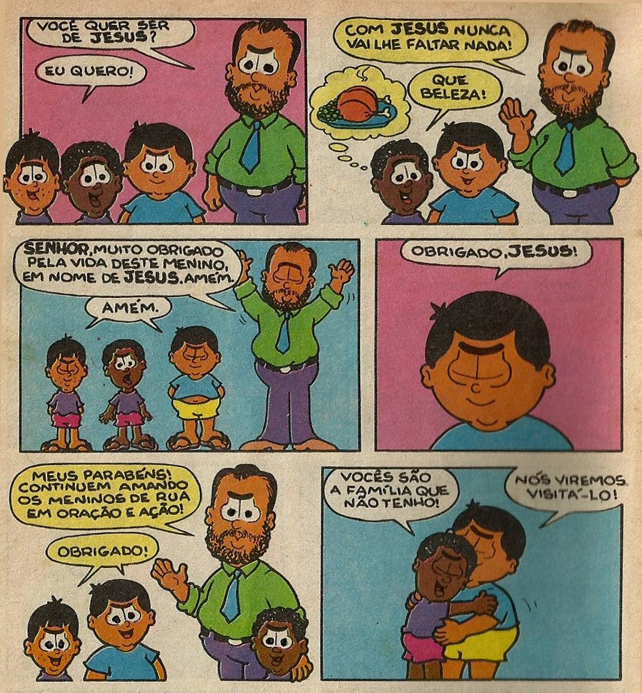

--- 
title: "Os efeitos da Conversão Religiosa entre Egressos de Comunidades Terapêuticas"
subtitle: "Uma análise comparativa"
author: 'Fernando Anderson Pereira de Souza'
date: "`r Sys.Date()`"
lang: "pt-BR"
bibliography: ["bib/dis.bib", "bib/not.bib", "bib/pkgs.bib"]
site: bookdown::bookdown_site
---

# Introdução {#intro}

  Entre maio e julho de 2020 um dos assuntos mais comentados do Twitter^[Disponível em: https://bityli.com/rm13V] foi uma coleção de revistinhas infantis evangélica chamada "Dudão". Lançada pela Editora Vida entre os anos de 1991 e 2000, e com um corpo editorial feito majoritariamente por protestantes, a HQ segue a vida de Dudão, um menino cristão, e seus amigos Binho, Paçoca, Rebeca, Zuca e Pita.
  
  Boa parte das histórias se resumem à Dudão ajudando seus amigos, seja com conselhos religiosos ou ações diretas, a saírem das enrascadas que eles se meteram. Dentre as várias histórias disponíveis uma me chamou a atenção. Em _"Elas estão por aí"_ Dudão encontra Binho, seu amigo, chorando desolado em um campo após ter tido suas chinelas roubadas por um garoto de rua. Dudão e Binho passam boa parte da história tentando localizar o dito cujo até que o encontram embaixo de uma ponte. Quando eles tentaram pegar os calçados de volta a criança pediu que não batessem nele e justificou as suas ações falando que "nunca teve uma chinela". Sensibilizados, Binho e Dudão acabam indo conversar com o pastor da igreja deles para saber se o garoto podia ficar no orfanato regido pela instituição. A imagem abaixo é extraída diretamente da revistinha e descreve o evento em questão:
  
```{r imagem00, echo = FALSE, fig.cap = " (Em ordem) Binho, Menino de Rua e Dudão conversando com o Pastor", fig.pos = "H", fig.align='center', out.width="60%" }


```

\bcenter
Fonte: Dudão, 1995
\ecenter
  
  O pastor pergunta a criança se "ela quer ser de Jesus" e fala que "com Jesus nunca lhe faltará nada", o que leva a criança a pensar em um belo frango assado e reiterar a sua escolha. Apesar de caricata a história é exemplo de uma prática muito comum no meio cristão brasileiro: embrulhar teologia nas boas ações. 
  
  É frequente, principalmente no meio protestante, que as ações de cunho social empregadas sejam também formas de evangelização e anúncio da boa nova^[ Mais informações sobre essa discussão podem ser encontradas em Rezende & Oliveira[-@rezende_as_2014]]. O _modus operandi_ dessas instituições se baseia em, na maioria das vezes, fornecer subsídios morais e espirituais junto com a ajuda material, sendo estes quase sempre ancorados no processo de "aceitar Jesus", em outras palavras, Conversão Religiosa. Dentre as que se utilizam dessas técnicas uma vem ganhando cada vez mais destaque, chegando até mesmo a ser pauta nas eleições de 2020: As _Comunidades Terapêuticas._
  
  Essas instituições costumam ofertar acolhimento e cuidado para pessoas que mostram sinais de uso abusivo de drogas^[Neste trabalho opto pelo termo "uso abusivo de drogas" ao invés de "dependência química". Isso acontece, principalmente, pela estigmatização que este segundo termo carrega consigo [@rosa2010uso]. Não é a pretensão deste estudo debater uso de drogas por uma ótica moralista ou patológica, muito menos condenar ninguem. Aqui pretende-se instaurar um diálogo aberto, horizontal e longe de esteriótipos.] por longos períodos por meio de abstêmia e dentro delas é comum que, junto com o cuidado físico e mental, também se ofereça um espiritual que acontece na forma de missas, cultos, leituras da bíblia e incentivo direto/indireto a Conversão. 
  
  Tais práticas imbuíram essas instituições de diversas controvérsias, de forma que vários Conselhos e instituições se manifestaram contra elas, sendo essas críticas adereçadas com mais força quando as CT's começaram a receber financimaneto público. Apesar de parecer uma questão relativamente simples, ela está envolta em uma trama mais densa e se demonstra bastante peculiar dado os atores que se movem em sua defesa. 
  
  Apesar de tudo isto, algumas perguntas devem ser feitas: Alimentar essas práticas religiosas no contexto do tratamento tem algum efeito prático no resultado final? No meio de tantas argumentações pouco ou quase nada se ouve falar sobre a eficácia dos próprios métodos empregados por estas instituições, principalmente no que corresponde as pessoas que já passaram por esse tipo de tratamento. Como essas pessoas se encontram hoje? Elas continuam abstêmicas? Se sim, a que elas atribuem esse processo? A Conversão que foi oferecida no contexto da Comunidade Terapêutica teve alguma influência no resultado final? E o mais importante: Vale a pena investir nesse tipo de método?
  
  Estas e outras indagações moveram a construção desta pesquisa. Nas próximas páginas será possível encontrar debates mais detalhados sobre o que são essas instituições, o que é Conversão e se, de fato, isso teve ou não efeito entre os que passaram por este tipo de tratamento.


